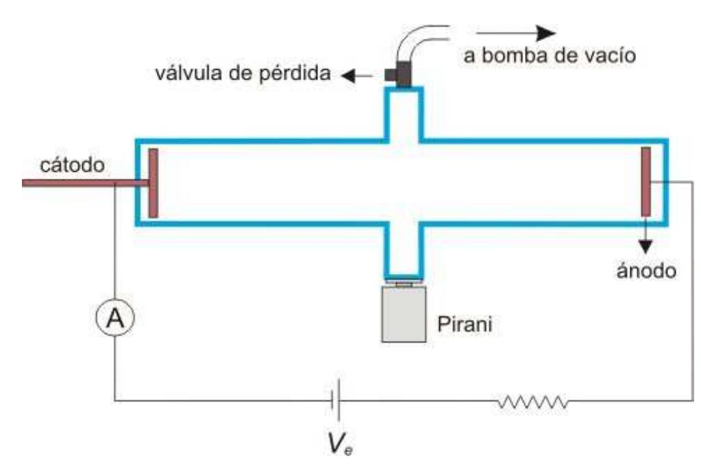
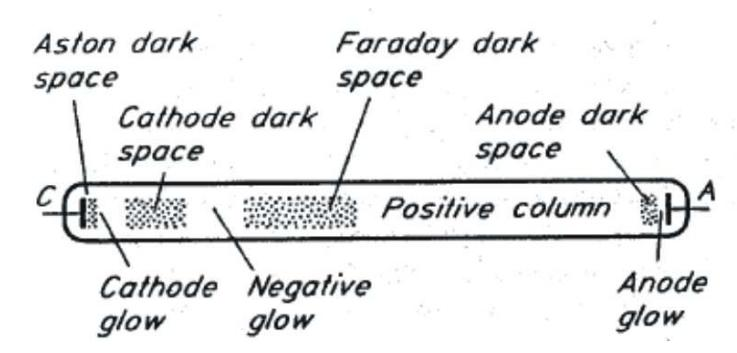
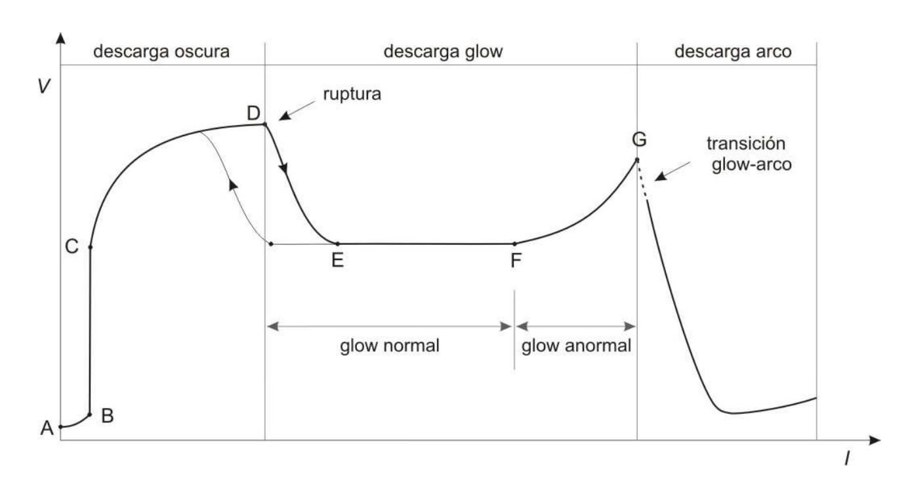
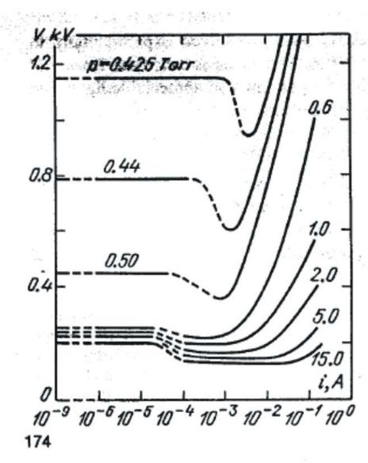
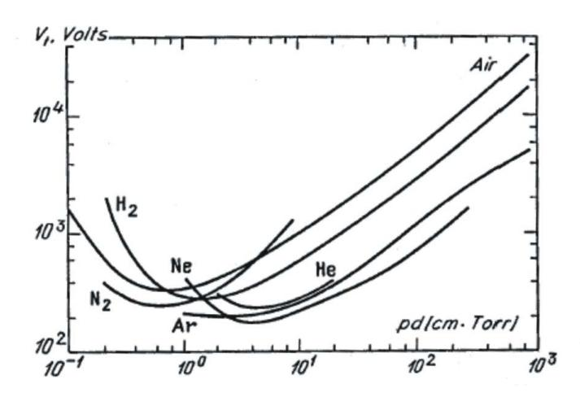

## Resumen

> Borrador inicial generado desde PDF con marker-pdf. Revisar y editar para fidelidad conceptual.

## Objetivos de aprendizaje

- (Completar con base fiel en la guía)
- (Completar con base fiel en la guía)
- (Completar con base fiel en la guía)

## Desarrollo conceptual del fenómeno

# Descarga Glow

## Introducción

La descarga glow es una descarga eléctrica autosostenida que se produce en un medio gaseoso. Consideremos un dispositivo como el que se esquematiza en la Figura 1. Una fuente de tensión aplica un voltaje Ve al circuito, determinando un voltaje V entre un par de electrodos ubicados en el interior de un tubo cerrado que contiene un gas determinado. Si el voltaje de alimentación Ve es muy bajo, prácticamente no hay conducción de corriente a través del medio gaseoso y el voltaje interelectródico es igual a Ve. Sin embargo, si aumentamos Ve podemos notar que a partir de un valor dado se produce una descarga a través del gas, estableciéndose una corriente interelectródica. Esta descarga se origina cuando electrones "semilla" (inyectados artificialmente o producidos por rayos cósmicos o radiación UV) son acelerados por el campo eléctrico y alcanzan una energía suficiente para ionizar a los átomos o moléculas del gas. A partir de allí se inicia un proceso de avalancha electrónica cuya magnitud depende de varios factores: tasa de ionización, pérdida de energía (colisiones elásticas, excitación), pérdida de electrones (difusión, recombinación).

Figura 1: dispositivo experimental para producir la descarga glow.

# Características de la descarga glow

serie alternada de zonas luminosas y oscuras. En la Figura 2 se esquematiza la distribución y denominación de las distintas zonas (el Apéndice contiene una breve explicación del origen y características de estas zonas).

Figura 2: zonas luminosas y zonas oscuras de la descarga glow en un tubo.

### Curva voltaje-corriente

Las curvas del voltaje interelectródico V en función de la corriente I que circula a través del circuito permiten obtener mucha información acerca de la descarga. En la Figura 3 se puede ver una curva típica de V vs. I.

Figura 3: curva típica del voltaje interelectródico en función de la corriente a través del circuito.

#### Descarga oscura

El régimen entre los puntos A y D de la curva recibe el nombre de descarga oscura ya que la excitación del medio gaseoso es tan pequeña que no se observa emisión de luz.

A – B: se observa una corriente débil provocada por la migración hacia los electrodos de cargas espurias (producidas mayormente a fuentes externas de radiación). Si se aumenta el voltaje entre los electrodos se observa un aumento de la corriente debido a una mayor eficiencia en la colección de las cargas.

B – C: si el voltaje se aumenta lo suficiente se colecta la mayor cantidad de cargas espurias posibles y se alcanza una saturación en la corriente. En esta región la corriente permanece constante a pesar de que aumente V.

C – D: si se sigue aumentando el voltaje la corriente comienza a crecer exponencialmente. La energía que alcanza un electrón inicial es suficiente para ionizar un átomo o una molécula del gas. Si el campo es suficientemente intenso el electrón secundario (producto de esa ionización) puede ionizar otro átomo o molécula, produciendo un efecto de avalancha. Esta región recibe el nombre de descarga Townsend. Las corrientes típicas de esta región varían entre 10-10-10-5 A.

D: ruptura eléctrica. En este punto la corriente puede aumentar entre 4 y 8 órdenes de magnitud. Se suma a la corriente la contribución de cargas liberadas en procesos de emisión secundaria debida a la incidencia de iones y fotones sobre el cátodo.

### Descarga glow

Esta región de la curva debe su denominación a la emisión de radiación visible que se produce (glow = brillo). La luminosidad se debe a que la energía y densidad de las cargas son suficientes para provocar numerosas excitaciones en el medio gaseoso, cuya desexcitación produce emisión de luz.

E – F: después de una transición abrupta entre D y E se alcanza el régimen de descarga glow normal. En esta región el voltaje interelectródico es prácticamente independiente de la corriente. A medida que aumentamos el voltaje de alimentación Ve aumenta la corriente sin haber modificaciones en V. Esto se debe a que se produce un aumento del área a través de la cual fluye la corriente, sin cambio de la densidad de corriente j.

F – G: cuando se cubre el área del cátodo totalmente (punto F), la corriente se aumenta a expensas de un aumento en j, lo cual se traduce en un aumento de V. A esta región se la denomina descarga glow anormal. Si se parte del punto F y se recorre la curva hacia la izquierda se observa un ciclo de histéresis.

### Descarga arco

Cuando la corriente alcanza valores típicos de 1 A la descarga glow precipita en un arco. En esta zona de la curva se produce una fuerte caída de V y un aumento de I.

### Comportamiento con la presión

La Figura 4 muestra una serie de curvas V vs. I en las que se recorren los regímenes de descarga oscura, glow normal y glow anormal, para distintas presiones. Se puede observar cómo aumenta el rango de valores de corriente para los cuales existe glow normal a medida que se incrementa la presión. Los datos de esta figura corresponden a una descarga en Neón.

Figura 4: curvas V vs. I para distintas presiones de Neón.

### Curvas de Paschen

El voltaje de ruptura (Vt), también llamado potencial de ignición (punto D de la Figura 3), depende del gas utilizado, del material del cátodo, de la presión (p) y de la distancia entre los electrodos (d). En la Figura 5 se pueden ver las curvas de Paschen, que muestran la dependencia de Vt con el producto pd.

Figura 5: curvas de Paschen para distintos gases.

Estas curvas presentan un mínimo que corresponde al punto en que los electrones poseen la máxima capacidad de ionización. Para valores de pd menores que este punto (rama izquierda de la curva de Paschen), la probabilidad de colisión entre los electrones y las partículas del gas es muy pequeña y, por lo tanto, es necesario aumentar el campo eléctrico para lograr una amplificación que desencadene una descarga autosostenida. Para valores grandes de pd (rama derecha de la curva de Paschen) el aumento de Vt es causado por un aumento de las pérdidas de electrones en el sistema.

# Dispositivo experimental

En la Figura 1 se esquematiza el dispositivo propuesto para observar y analizar una descarga glow. Un par de electrodos se ubican en el interior de un tubo de vidrio que puede ser evacuado utilizando una bomba mecánica de vacío. La posición de uno de los electrodos se puede modificar de forma que es posible variar la distancia interelectródica. La presión se puede regular entre ~10-2 torr y 1 bar introduciendo una válvula de pérdida en el sistema. La medida de la presión se obtiene utilizando un sensor de vacío pirani. El circuito se alimenta con una fuente de alta tensión que se conecta en serie con una resistencia de alta potencia de .... ohms. Los parámetros típicos involucrados en la descarga son: d ~ 5-100 cm, p ~ 10-2 mbar - 1 bar, V ~ 100-1000 V, I ~ 10-4-10-1 A.

# Posibles puntos a desarrollar

- Caracterizar el comportamiento de la descarga a través de una curva de V vs. I e identificar los diferentes regímenes encontrados.
- Encontrar el voltaje de ruptura en función del producto pd y reproducir la curva de Paschen.
- Extender el estudio a diferentes gases.

### Algunas preguntas

- ¿Qué sucede si se coloca una fuente de radiación de alta energía en las cercanías del dispositivo?
- Al recorrer la curva V vs. I en ambos sentidos es posible observar efectos de histéresis. ¿A qué atribuye este fenómeno?
- ¿Espera una dependencia de las características de la descarga con la temperatura del medio gaseoso?

### Apéndice

La distribución luminosa en la descarga puede interpretarse cualitativamente en términos de la energía ganada por los electrones en presencia del campo eléctrico.

Espacio oscuro de Aston: una zona delgada junto al cátodo, en la que los electrones son acelerados por un campo eléctrico intenso. La densidad de electrones es muy baja y/o la energía de los electrones es insuficiente para excitar el gas, entonces aparece como una región oscura.

Glow catódico: Los electrones poseen energía suficiente excitar a los átomos o moléculas del gas. Puede aparecer una estructura de dos o tres capas de diferentes colores correspondientes a la excitación de diferentes niveles atómicos o moleculares.

Espacio oscuro catódico: la energía de los electrones excede los potenciales de excitación y aparece una zona relativamente oscura. Es aquí donde tienen lugar la mayoría de las ionizaciones.

Glow negativo: en la parte final del espacio oscuro catódico el flujo de electrones se hace grande y la energía de los electrones (que en su mayoría han perdido energía en colisiones con las partículas del gas) es nuevamente próxima a las energías de excitación. Por lo tanto, aparece una zona luminosa, que también puede tener estructura de capas.

Espacio oscuro de Faraday: a medida que los electrones disipan su energía comienza a aparecer el espacio oscuro de Faraday. El campo eléctrico en esta región es pequeño y la energía ganada por los electrones no es suficiente para excitar el medio.

Columna positiva: en esta zona los electrones se encuentran termalizados (1-2 eV) y el campo eléctrico es relativamente uniforme, al igual que la luminosidad que presenta la columna.

Espacio oscuro anódico: entre la columna positiva y el ánodo aparece una pequeña zona oscura debido a que la energía perdida por los electrones en la columna positiva no puede ser recuperada por el campo eléctrico.

Glow aniónico: en la región del ánodo los electrones son acelerados por la presencia de un campo eléctrico algo más elevado que en la zona de la columna positiva y el espacio oscuro anódico, resultando la formación de un glow aniónico.

> Nota de revisión: validar manualmente ecuaciones, bloques matemáticos y notación física luego de la conversión automática.

## Ejes de exploración experimental

- (Revisar y reformular evitando formato receta)
- (Revisar y reformular evitando formato receta)
- (Revisar y reformular evitando formato receta)

## Preguntas orientadoras

- ¿(Completar)?
- ¿(Completar)?
- ¿(Completar)?

## Seguridad específica

- (Agregar normas y enlaces pertinentes)

## Recursos y referencias

- Texto de práctica: http://materias.df.uba.ar/l5a2023v/files/2023/02/glow_Gu%C3%ADa.pdf

## Fuente original

- Conversión automática con marker-pdf (requiere revisión de sintaxis/formato).
- Fuente principal: http://materias.df.uba.ar/l5a2023v/files/2023/02/glow_Gu%C3%ADa.pdf
