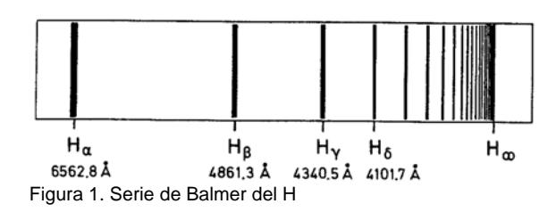
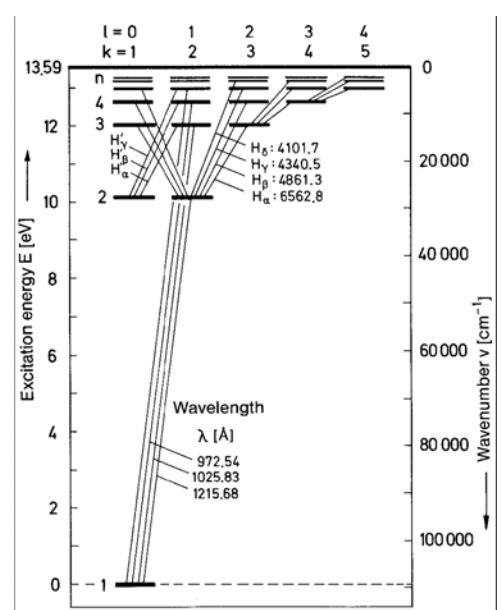
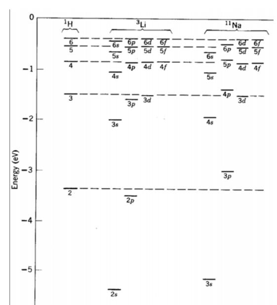
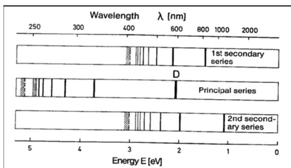

## Resumen

> Borrador inicial generado desde PDF con marker-pdf. Revisar y editar para fidelidad conceptual.

## Objetivos de aprendizaje

- (Completar con base fiel en la guía)
- (Completar con base fiel en la guía)
- (Completar con base fiel en la guía)

## Desarrollo conceptual del fenómeno

# **Laboratorio 5. Práctica de Espectroscopía**

#### **Espectros de emisión**

La idea de este experimento es estudiar los espectros de emisión de diferentes átomos y moléculas. Se examinarán los niveles de energía cuantizados de varios átomos y moléculas en fase gaseosa que se encuentran contenidos en tubos de descarga. Entre otros aspectos a estudiar se sugiere testar la validez del modelo de Bohr para el hidrógeno, estimar el valor de la constante de Rydberg, estudiar el acoplamiento spinórbita y estimar la carga nuclear efectiva en Na, y estudiar la estructura de algunas moléculas como la de N2.

Desde el punto de vista experimental se espera que aprendan las bases de la espectroscopía de redes y se entrenen en el uso de monocromadores y detectores de luz.

# **1. Introducción**

Esta es una brevísima introducción al tema. Siendo la espectroscopia unos de los pilares básicos del conocimiento en física atómica y molecular, hay una variada y extensa bibliografía que se puede consultar (ver Bibliografía).

Una gran parte del conocimiento de la estructura atómica proviene de la observación de la forma en que esos átomos absorben o emiten luz. Si a la luz proveniente de alguno de estos procesos se la separa en colores con un prisma o una red de difracción, esta se ve como una colección de líneas muy angostas, que son características de cada átomo en cuestión. La existencia de estas "líneas espectrales" es una manifestación directa de la cuantización de los niveles electrónicos.

En el caso más simple, el del hidrogeno, en donde hay solo un electrón orbitando alrededor de un núcleo, las líneas espectrales pueden utilizarse para verificar el modelo de Bohr. Sin embargo, otros átomos con estructura más complicada, mostrarán efectos que el modelo simple de Bohr no puede explicar como el apantallamiento nuclear debido a electrones interiores, interacción del spin del electrón con el magnetismo atómico, etc. Además, cuando los átomos se combinan en moléculas, aparecen otros términos adicionales a la energía que dan cuenta de los grados de libertad vibracionales y rotacionales, que resultan en bandas espectrales más complejas. Todos estos efectos pueden explicarse con la teoría cuántica de Schrödinger.

# a) **H**. Modelo de Bohr. Serie de Balmer

Según el modelo de Bohr, las órbitas electrónicas tienen valores cuantizados de energía y se identifican con el numero *n* (numero cuántico principal) Para una transición entre dos estados *n1* y *n2* , el fotón emitido u absorbido tendrá la energía:

⎟ ⎟ ⎠ ⎞ ⎜ ⎜ ⎝ ⎛ −===−=Δ + 2 2 2 1 12 11 *nn hcR hc hEEE H* λ ν (1)

donde *RH*=109737.318 cm-1 es la llamada constante de Rydberg, *h* es la constante de Planck y *c* es la velocidad de la luz en el vacío. Notar que cm-1 es una unidad muy usada en espectroscopía que comúnmente se llama "numero de onda", y tiene su equivalente en unidades de energía (eV, Joule, etc) simplemente multiplicando por *hc* en el sistema de unidades correspondiente. Para la llamada serie de Balmer, correspondiente al H, *n1=*2. Existen otra series en el ultravioleta e infrarrojo (Lyman y Paschen) con *n*1=1 y *n*1=3.

Los resultados obtenidos por Bohr con un cálculo semiclásico pueden obtenerse resolviendo la ecuación de Schrödinger para una función de onda electrónica en un potencial esférico de Coulomb. En la solución de Schrödinger cada estado electrónico está definido por tres números cuánticos, *n, l y m*. El número cuántico principal *n* determina la energía del estado y la forma radial de la función de onda, mientras que el número cuántico *l* especifica la parte angular de la función de onda y el momento angular total ( ). El número *m* es la proyección del momento angular total en un dado eje ( ). En ausencia de un campo magnético externo es de esperar que la energía del estado no dependa de la orientación en el espacio y por lo tanto sea independiente de *m*. En el caso de potencial de Coulomb la energía además es independiente de *l*, como consecuencia no trivial de su simetría esférica. Por lo tanto los niveles de energía electrónica del H son sólo dependientes de *n* y degenerados en *l* y *m*. Esto puede verse en la Figura 2. Notar que las transiciones siempre ocurren respetando la "regla de selección" , pero como los estados del H están degenerados, esto no tiene consecuencias en el espectro de emisión. Sin embargo estas reglas tienen consecuencias importantes para los espectros de átomos no monoelectrónicos. *nl* −≤ 1 ≤≤− *lml l* ±=Δ 1

Figura 2. Diagrama de niveles del Hidrogeno

Los metales alcalinos (Li, Na, K, Rb, Cs) se caracterizan por tener un solo electrón de valencia, es decir un solo electrón con *l=0* fuera de una capa cerrada. Ya que las capas cerradas son muy estables, el espectro de emisión está dominado por ese único electrón activo, que siente el potencial de Coulomb del núcleo, pero apantallado por la carga de las capas interiores. Se introduce entonces el concepto de carga efectiva Zef que tendrá un valor será cercano a 1 para los átomos alcalinos, para los cuales, en principio, se espera un espectro de emisión similar al del H.

Figura 3. Niveles de energía del litio, sodio e hidrogeno.

Los niveles energéticos del H, Li y Na se muestran en la Figura 3, donde se emplea la notación: s, p, d y f por *l*= 0, 1, 2, 3. El comportamiento hidrogenoide del sodio puede verse recién para los estados 6d y 6s, mientras que para valores más bajos de *l*, hay marcadas diferencias. Esto se debe a que para valores bajos de *l*, los orbitales electrónicos penetran dentro de las capas cerradas y electrón siente más carga nuclear, lo que produce un descenso en la energía de Coulomb.

Utilizando el concepto de carga efectiva, que será entonces dependiente de *n* y *l*, puede hacerse un análisis de los espectros similar al descripto por la ecuación (1) para el H. es una medida de la carga efectiva que experimenta el electrón en el orbital *nl*. Para el caso del sodio se encuentran las siguientes series: *nl Zef*

Serie Sharp → *pns* )3( () () ⎟ ⎟ ⎠ ⎞ ⎜ ⎜ ⎝ ⎛ −=Δ +2 2 3 1 3 1 *ns ef p ef H ZnZ hcRE* con *n*= 4, 5, 6 … (2)

Serie Principal → *snp* )3( () () ⎟ ⎟ ⎠ ⎞ ⎜ ⎜ ⎝ ⎛ −=Δ +2 2 3 1 3 1 *np ef s ef H ZnZ hcRE* con *n*= 3, 4, 5 … (3)

Serie Diffuse → *pnd* )3( () () ⎟ ⎟ ⎠ ⎞ ⎜ ⎜ ⎝ ⎛ −=Δ +2 2 3 1 3 1 *nd ef p ef H ZnZ hcRE* con *n*= 3, 4, 5 … (4)

Figura 4. Algunas series del espectro de Na.

Cuando los espectros del Na se analizan con suficiente resolución, se encuentra que hay varias líneas separadas en "dobletes". Ustedes conocerán el famoso el doblete D (serie Principal) del sodio, de longitudes de onda 589nm y 589.6nm. Este desdoblamiento de las líneas es causado por una propiedad puramente cuántica, el spin electrónico, y por la interacción spin-órbita, es decir la interacción entre el momento magnético intrínseco del electrón y el campo magnético local creado por el átomo.

La energía debida a la interacción spin-órbita toma dos valores (debido a las dos orientaciones del spin) *BgE* 4/ − =Δ ± μ *Bsos* , donde μ *B* = 0.4669 cm-1 Tesla-1 es el magnetón de Bohr, *gs* es el factor giromagnético (de valor cercano a 2 para el electrón) y *B* es el campo magnético producido por la rotación relativa del electrón y el átomo (proporcional a L, momento angular total). Para el caso del doblete principal del Na, la diferencia de energía entre 3p3/2 y 3p1/2 proviene de cambiar la orientación del spin en 1 unidad, manteniendo constante la parte orbital. Este cambio de energía es de aproximadamente 17 cm-1 (estimar qué campo magnético externo *B* se debiera aplicar para tener el mismo desdoblamiento de niveles que se tiene por interacción spin-órbita).

## c) **N2**. Molécula diatómica

El espectro de emisión es más complejo que el de átomos individuales, ya que la emisión electrónica está convolucionada con los grados de libertad vibracional y rotacional de la molécula. Esto produce un espectro de bandas en lugar de líneas. En la aproximación de Born-Oppenheimer la función de onda molecular puede ser separada en una contribución electrónica y una contribución nuclear que da cuenta de las vibraciones y las rotaciones. Consultar la bibliografía para obtener espectros típicos de moléculas diatómicas.

#### **2. Experimental**

En el laboratorio se cuenta con un monocromador/espectrómetro marca Jarrell-Ash modelo MonoSpec 27, que posee una red de difracción de 600 líneas/mm, y un detector fotomultiplicador (PMT) alimentado con una fuente de alta tensión. Además están disponibles varias lámparas de descarga: H2, He, Ar, Kr, Hg, Ne, H2O, Na. Y variado equipamiento de electrónica que se encuentra en el pañol y que es muy conveniente que ustedes conozcan (para usar eventualmente en esta y otras prácticas).

#### Monocromador:

#### Generales:

El monocromador es del tipo Czerny-Turner (estén seguros de que sabne cómo funciona, hagan un diagrama). La red del monocromador se mueve adosada a una plataforma rotante empujada por un tornillo micrométrico. Este movimiento le permite tomar el valor del ángulo que corresponde a la dirección de la dispersión de la longitud de onda deseada. El tornillo se mueve accionado por un mecanismo de transmisión provisto por una correa, la cual se hace girar con una manivela manualmente o con un motor de pasos. **Debido a que el tornillo puede clavarse en los extremos del recorrido, es importante que usen el monocromador solamente accionado por el motor, nunca manualmente. No sobrepasar el límite de los 1000 nm.** El motor tiene un controlador que se maneja con un programa desde de la computadora. Este programa permite además tomar una señal de tensión que proviene de la salida del detector PMT, y así levantar los espectros. Los detalles del programa de control están en un archivo adjunto. También hay disponible en la página de la materia un archivo de redes y monocromadores, que es **muy** recomendable consultar (Diffraction grating Handbook), aunque lo pueden encontrar en sus libros preferidos de óptica. Además, es importante que antes de utilizar el monocromador **lean el manual del equipo** (disponible en el pañol). Una vez consultada la bibliografía y el manual, asegúrense que tienen claro al menos los siguientes conceptos:

- a) cómo dispersa una red, (y en particular la red que tiene nuestro monocromador), qué es el poder resolverte de la red, el blaze, etc
- b) la resolución espectral del monocromador, cómo depende del espaciado de la red y cómo del tamaño de las rendijas de entrada y salida del monocromador. Qué resolución esperan en su experimento. Qué resolución necesitan para, por ejemplo, resolver el doblete principal del Na? (Pueden preguntarse lo mismo para la serie de Balmer, de Lyman, etc). Después de tener las estimaciones claras, propongan y realicen un experimento para estimar cuánto es la resolución.

# Calibración:

- a) Por qué se debe calibrar el monocromador? Hay una rutina de calibración en el programa de control.
- b) Qué lámpara o lámparas usaría para calibrar el monocromador? (tengan en cuenta que las lámparas suelen tener impurezas de otro gas, por ejemplo la lámpara de mercurio suele presentar también líneas de K, fíjense si las ven y evalúen si las pueden usar para calibrar)

# Lámparas de descarga:

CUIDADO: la lámpara de Hg tiene varias líneas intensas en el UV. Esta radiación puede ser perjudicial para los ojos y la piel, si la exposición es prolongada y/o directa. Trabajen siempre cubriendo la lámpara con cartulina negra, sólo exponiendo la parte enfrentada al monocromador.

Las lámparas son de la marca Electro-Technic, y se colocan en un soporte especial que encierra el circuito que provee la corriente necesaria para la operación de la lámpara. Augúrense de poner y sacar con cuidado las lámparas del soporte, haciendo presión sobre los resortes. Tener cuidado al sacarlas ya que pueden estar calientes.

Cómo funciona una lámpara de descarga?

Necesitan poner una lente en la entrada del monocromador?

# Fotomultiplicador (PMT):

La hoja de datos del fotomultiplicador Hamamatsu 1P28 está disponible en el laboratorio y en la página de la materia. En ella encontrarán la respuesta espectral del PMT que les servirá a la hora de analizar la intensidad relativa que esperan de cada línea.

Importante: el PMT se alimenta con alta tensión (hasta alrededor de 1000 V), es importante **no encender la luz de los tubos fluorescentes** de la habitación ni exponerlo a luz ambiente mientras la alta tensión está conectada. Aún cuando la alimentación está apagada no es conveniente exponer al PMT a la luz ambiente, esto reduce su vida útil y aumenta el ruido de oscuridad, por lo tanto conviene mantenerlo con su fotocátodo cubierto. De todas formas, como durante el experimento el PMT estará adosado a la salida del monocromador (y por lo tanto cubierto su fotocátodo), ustedes pueden iluminarse con veladores, lámparas de poca potencia o linternas (también les va a preocupar el ruido ambiente que "ve" el PMT en una medición sensible). Trabajar en oscuridad total puede estar bien para un momento pero puede ser peligroso a la hora de moverse por la habitación.

Para una explicación de cómo funciona el PMT pueden consultar la página de Hamamatsu o el material que hay en la página de la materia.

Antes de comenzar a medir, testee los niveles de señal que detecta el fotomultiplicador para cada dada tensión de alimentación. Evalué si necesita amplificar, cómo van a medir y/o adquirir esa señal y qué equipamiento extra necesitan (si es que lo necesitan).

#### **3. Algunas actividades. (esta es una lista incompleta, ustedes pueden proponer otras):**

Para trabajar con cualquiera de las lámparas, consulten primero la base de datos de espectros (por ejemplo:

[http://physics.nist.gov/PhysRefData/Handbook/element\\_name.htm,](http://physics.nist.gov/PhysRefData/Handbook/element_name.htm) es una base del NIST) para conocer los niveles de energía, las transiciones permitidas y la intensidad relativa de las transiciones (hay más referencias en Bibliografía). **Estos datos los deben tener a mano.** 

- a) Medir la serie de Balmer del H.
- b) Medir la constante de Rydberg.
- c) Para las lámparas disponibles en el laboratorio, contrastar los espectros de tablas con los medidos. Analizar reglas de selección de los espectros. Qué rango espectral podrán medir en cada caso? Pueden analizar la intensidad relativa? Si de una determinada línea espectral se espera poca intensidad relativa, qué pueden modificar experimentalmente para llegar a verla? (Piensen en la ganancia del PMT). Cómo afecta la velocidad del barrido del monocromador?

- d) Para el Na tratar de resolver algún doblete (habiendo estimado la resolución, hagan los cambios necesarios para que ésta alcance).
- e) Relevar el espectro de alguna molécula diatómica. Pueden identificar vibraciones? Y rotaciones? Extras:
- f) Para el caso del Na traten de identificar algunas de las transiciones de las series discutidas en la introducción. Qué reglas de selección obedecen esas transiciones?.
- g) Tratar de estimar la carga efectiva . Para esto consultar el paper de referencia
- 5. *nl Zef*

# **Bibliografía**

- 1. B. W. Shore, D. H. Menzel, *Principles of atomic spectra,* Wiley, 1968.
- 2. CRC Handbook of Chemistry and Physics, CRC Press: Boca Raton, FL , 2001.
- 3. R. Eisberg *Fundamentos de física moderna*. Wiley, 2001.
- 4. H. Haken and H. Wolf, *The Physics of Atoms and Quanta*, Springer 1994.
- 5. Da Piedade et al, "A Procedure to Obtain the Effective Nuclear Charge from the Atomic Spectrum of Sodium", J. Chem. Ed. 76, 1269-1271 (1999)

> Nota de revisión: validar manualmente ecuaciones, bloques matemáticos y notación física luego de la conversión automática.

## Ejes de exploración experimental

- (Revisar y reformular evitando formato receta)
- (Revisar y reformular evitando formato receta)
- (Revisar y reformular evitando formato receta)

## Preguntas orientadoras

- ¿(Completar)?
- ¿(Completar)?
- ¿(Completar)?

## Seguridad específica

- (Agregar normas y enlaces pertinentes)

## Recursos y referencias

- Texto de práctica: http://materias.df.uba.ar/l5a2023c1/files/2012/07/Practica-de-Espectroscopia.pdf

## Fuente original

- Conversión automática con marker-pdf (requiere revisión de sintaxis/formato).
- Fuente principal: http://materias.df.uba.ar/l5a2023c1/files/2012/07/Practica-de-Espectroscopia.pdf
