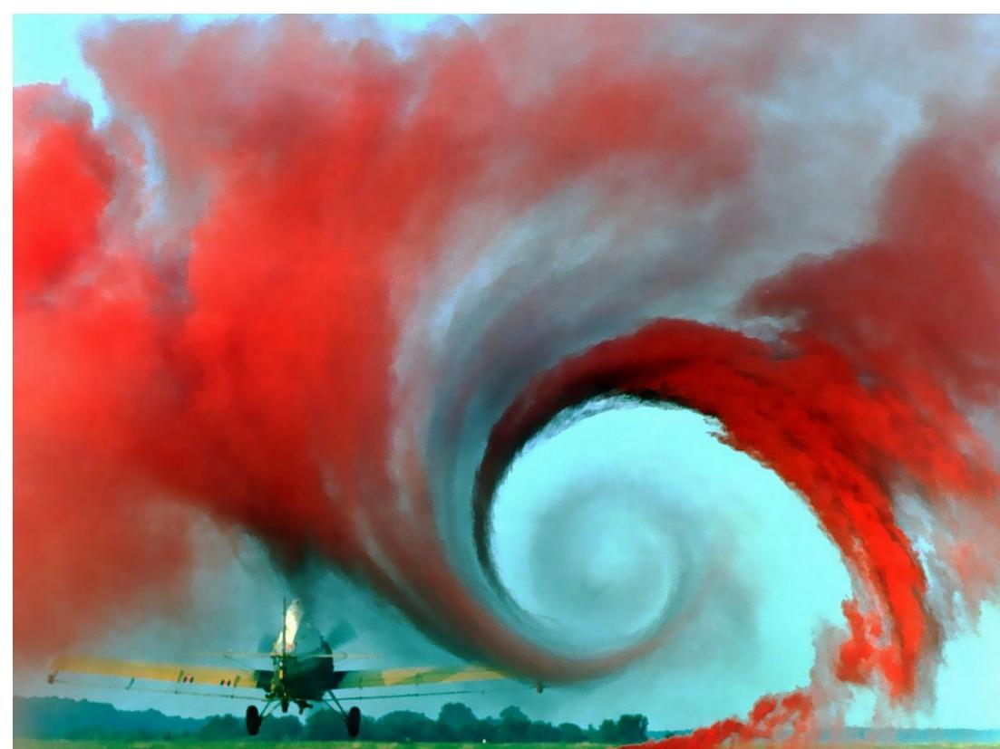
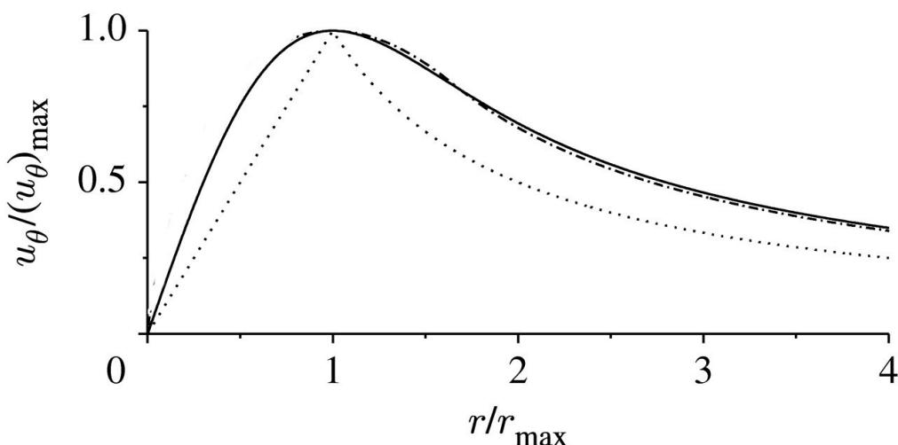
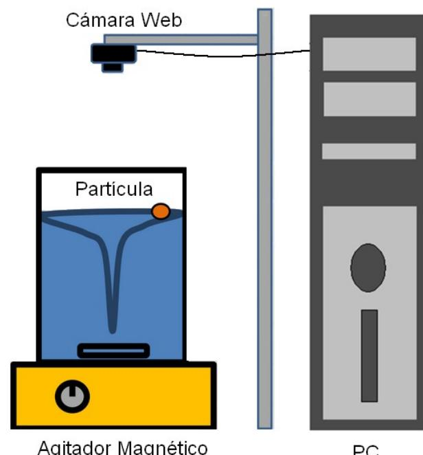
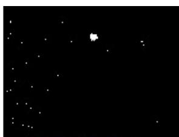
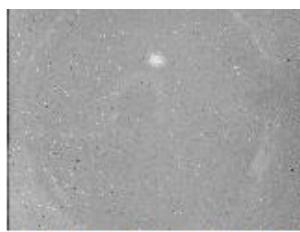
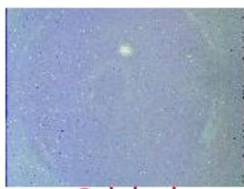
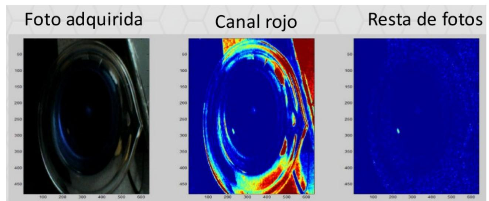

## Resumen

> Borrador inicial generado desde PDF con marker-pdf. Revisar y editar para fidelidad conceptual.

## Objetivos de aprendizaje

- (Completar con base fiel en la guía)
- (Completar con base fiel en la guía)
- (Completar con base fiel en la guía)

## Desarrollo conceptual del fenómeno

#### **Práctica de Laboratorio 5. Fluidos**

Federico Barrera, Joel Bobadilla, Agostina Lo Giudice

#### **Introducción**

El objetivo de esta práctica es caracterizar el campo de velocidades de una partícula situada en un vórtice, generado en el seno de un medio fluido dentro de un recipiente cilíndrico. Un vórtice es esencialmente una región del medio, caracterizada por un eje alrededor del cual rotan las partículas de fluido. En la figura 1, puede visualizarse el vórtice creado por el paso de las alas de una aeronave.

Figura 1: El vórtice debido al paso de las alas de esta aeronave, es visualizado a través de una técnica basada en la emisión de gas coloreado desde el suelo [1].

**L**os vórtices fuertemente localizados forman parte de una gran variedad de flujos de interés, como los que aparecen en el desprendimiento de vórtices sobre superficies sólidas (por ejemplo, sobre las alas de insectos o aeronaves), en el flujo a través de una turbina, o en tornados y remolinos a grandes escalas. En general estos flujos son muy poco entendidos debido a las distintas dificultades, tanto técnicas como teóricas, que aparecen al lidiar con los mismos [2].

Dos modelos elementales describen la dinámica de un vórtice en un fluido tridimensional:

*Modelo de Rankine.* En este modelo la vorticidad está uniformemente distribuida en un cilindro de radio *c* centrado según el eje del vórtice (al que tomaremos como eje z)*.* La velocidad tangencial tiene un salto discontinuo en el radio , mientras que las otras dos componentes de la velocidad permanecen nulas:

Para radios menores a *c*, el movimiento corresponde al de una rotación rígida, mientras que para radios mayoras a *c*, el flujo es irrotacional con una típica dependencia de tipo .

*Modelo de Burgers.* En un fluido real, la viscosidad suaviza la discontinuidad que se observa para en el modelo de Rankine. A fin de mantener una rotación estable, aparecen una componente axial y una componente radial de la velocidad:

En donde es la viscosidad cinemática, y representa un radio efectivo dentro del cual la componente tangencial de la velocidad se corresponde aproximadamente con la de una rotación rígida [2].

La Fig. 2 muestra las velocidades tangenciales en función del radio propuestas por ambos modelos. La línea punteada corresponde al modelo de Rankine, mientras que la continua al modelo de Burger.

# **Experimento: Medición del campo de velocidades de un vórtice generado por un agitador magnético.**

### **Objetivos**

Los objetivos de esta práctica son:

- Adquirir la posición de la partícula en función del tiempo;
- Calcular la velocidad tangencial y radial de la partícula;
- Variar los parámetros del experimento (tamaño del recipiente, viscosidad del fluido, frecuencia del agitador, etc.) y contrastar con los modelos teóricos;
- Calcular la posición y velocidad en z de la partícula y contrastarla con los modelos teóricos.

El primer objetivo podría realizarse en 2 clases. Los otros dos son más largos de alcanzar, pudiendo ser propuestos como tema de práctica especial.

## **Montaje experimental**

El montaje propuesto para esta práctica es el que se muestra en la Figura 3. Sobre un agitador magnético, se coloca un recipiente cilíndrico cargado con algún medio fluido. En el interior del recipiente, una pequeña barra imantada puede girar con frecuencia regulable dando lugar a un vórtice. Una pequeña "partícula" es lanzada sobre el fluido. El movimiento de esta es registrado

Figura 2: Velocidades tangenciales para un vórtice según el modelo de Rankine (línea punteada) y según el modelo de Burger (línea continua).

Figura 3: Disposición experimental

con la ayuda de una cámara Web. Los datos obtenidos son tratados en la PC de modo de deducir a partir de ellos el campo de velocidades del vórtice.

#### **Materiales:**

- 1 Agitador Magnético (Decalab, FBR)
- 1 recipiente de vidrio "pyrex"
- 1 cámara web
- Soportes y pies de apoyo.
- 2 nueces
- Tracer ("pelotita")

## **Algunas cuestiones para plantearnos y pensar a lo largo del trabajo:**

- ¿De qué manera es posible lograr que la cámara distinga entre la partícula y su fondo, de modo que cuadro a cuadro se registre la posición de la misma?
- ¿De qué forma la luz proveniente de fuentes externas a mi experimento afectan las mediciones?
- ¿El centro del vórtice es estático? ¿Cómo podemos determinar si es estático o no?
- ¿Cómo podría determinar el centro del vórtice? ¿Para qué nos serviría esta medición a la hora de calcular las velocidades tangencial y radial?
- Con el método de análisis de imágenes (ver **Sugerencias**) que elegimos, ¿es posible determinar la componente vertical del campo de velocidades?

## **Sugerencias**

*¿Qué método de procesamiento de imágenes podemos utilizar?*

Se propone el armado de un programa en la computadora (ya sea en MATLAB, Python o cualquier otro lenguaje) que sea capaz de tomar el video a filmar de la partícula moviéndose en el vórtice, y de calcular la posición de la partícula frame a frame de la misma (Obteniendo así la trayectoria)

El método va a determinar la calidad de nuestras mediciones, ya que uno puede ser más preciso que otro a la hora de adquirir la posición de la partícula. Éste no es independiente de los parámetros del sistema: Un buen contraste, por ejemplo, entre la partícula y el fluido en cuestión siempre es bueno para obtener mejores mediciones.

#### **Dos de los métodos que podemos llegar a usar son:**

#### **Por contraste de blancos y negros**

Podemos tomar nuestro video, pasarlo a escala de grises y reducir la cantidad de colores en la escala a dos (Lo que se llama "Thresholding"): Así, nos queda un video que sólo tiene dos colores; blanco puro por un lado, y negro.

Si el contraste entre la partícula y el fluido es lo suficientemente bueno, la partícula debería de quedar del color opuesto al del fluido.

Hecho esto, se puede pasar a colocar un disco (de tamaño que podamos determinar) encima de la región delimitada por la partícula en cada frame, y calcularle a éste su posición frame a frame.

Un disco, en realidad, se situaría sobre todo aquello que sea de color distinto al del fondo, con lo cual se podrían llegar a filtrar otras cosas que hayan contrastado con el fondo y que no sean la partícula (Reflejos, por ejemplo). El tamaño del disco influye sobre qué cosas se terminan siguiendo, y cuáles no.

#### **Preguntas a tener en cuenta al abordar este método:**

- ¿De qué manera vamos a lograr un buen contraste entre la partícula y el fluido? ¿Ayuda en que ya empecemos con una partícula blanca y un fondo negro, o viceversa? Una buena idea es teñir al fluido de un color contrastante con el de la partícula (Por ejemplo, fluido negro con una partícula blanca), o usar un fluido tal que no genere tantos reflejos (Por ejemplo, leche)
- ¿Qué tamaño de disco conviene usar?¿Si utilizo un tamaño más pequeño voy a ver más ruido? ¿Si utilizo un tamaño más grande por ahí me "paso" de ver la partícula?

## **Por filtrado de colores**

Una de las maneras de describir el color de una imagen es mediante el modelo rgb, en el que cualquier color puede ser representado como una combinación de rojo, azul y verde.

Podemos representar a una imagen como una superposición de tres imágenes (Canales verde, azul y rojo), en la que cada pixel de cada una representa la intensidad (0-255) del color

Figura 4: Secuencia de análisis de imágenes para el método propuesto. El disco mostrado en la última figura sólo sigue a las partículas de tamaño similar.

correspondiente. Es fácil visualizar a cada uno de los canales como imágenes en escala de grises, en las que las zonas más oscuras representan áreas con menor cantidad de ese color, y las zonas más claritas son aquellas que más cantidad de ese color aportan a la imagen.

Una idea es tener una partícula teñida con alguna tinta fluorescente (Rodamina, por ejemplo, que emite una luz verde) e iluminar al líquido de azul (Esto lo podemos lograr utilizando papel celofán sobre una lámpara común). De este modo, tenemos una configuración que "solo" tiene verde y azul. El restarle el canal rojo a una imagen tomada sobre esta configuración implicaría quedarnos con todo lo que es verde y azul, es decir, con lo que nos interesa (el rojo formaría parte del fondo y otras cosas de la imagen que no nos interesan). La partícula es un tono fosforescente de verde, con lo cual va a resaltar del fondo.

Aclaramos que la resta del canal rojo no implica que todo lo indeseable para la medición lo hayamos sacado, sino que directamente es un canal que no nos interesa visualizar ya que no es un color que presente la partícula.

Puede que otras regiones indeseables tengan componentes en verde y azul que no estemos sacando de la imagen, pero frente a la fosforescencia de la partícula, deberían ser despreciables.

# **Preguntas a tener en cuenta al abordar este método:**

- ¿Habrá alguna otra combinación de canales que sea óptima al querer sacar la máxima cantidad de regiones indeseables del video?

*Caracterizar a la cámara que se va a usar*

Esto implica conocer su resolución, la cantidad de frames por segundo que toma, en qué modo de color se guarda el video, etc. ¿Para qué nos puede servir esto?

Figura 5: Secuencia de pasos a seguir con este método. El sacar el canal rojo (marcado en la segunda figura en rojo) nos libera de tratar con muchas regiones que no nos interesan en el análisis. Observar el cómo contrasta la partícula con el fondo azul. (Foto extraída de "Estudio de velocidades de un vórtice generado por un agitador magnético", por Albanese F. y Simon S.A.)

Un dato importante a tener en cuenta respecto de la cámara es la relación píxeles que veo en el video – distancias físicas. ¿Cómo podemos determinar esta relación? ¿Qué tan importante es el que la cámara esté lo más derecha posible frente al recipiente? ¿A qué distancia debería ser colocada?

#### *Obtención de las velocidades a partir de la trayectoria*

Con los métodos antes mencionados, se debería obtener la posición (x,y) de la partícula a cada frame. Para contrastar los datos obtenidos con los presentados por la teoría, necesitamos las velocidades radial y tangencial de la partícula.

- ¿Cómo podemos calcular el Δt correspondiente al sucedido entre dos frames consecutivos?
- Al pasar de coordenadas cartesianas a polares, se tomaría el centro del vórtice como el centro de coordenadas polares. ¿Este centro está fijo o es móvil? ¿Qué tanto se mueve? ¿Es despreciable este movimiento (si es que lo hay)?

# *Variaciones que se le pueden realizar al experimento*

### – **Tamaño del recipiente**

Realizar las mismas mediciones pero con un recipiente de mayor o menor tamaño. Recomendamos usar recipientes que tengan una diferencia de dimensiones considerable (Por ejemplo, un vaso de precipitados de 800 ml y una palangana) ¿Cambia el comportamiento de los datos obtenidos? ¿A qué puede deberse esto?

## – **Viscosidad del fluido**

Lo normal es que las primeras mediciones se realicen con un fluido acuoso como medio (Como agua o leche). Se puede probar el ver qué sucede con los datos si utilizamos otros fluidos como aceite o engrudo (Más viscosos que el agua). ¿En qué cambiarán los datos obtenidos? El modelo de Rankine no tiene en cuenta las viscosidades, por lo cual no deberían modificarse éstos si dicho modelo es aplicable a nuestras mediciones. El modelo de Burgers introduce un cambio en las velocidades radial y en z a causa de la viscosidad, pero no en la tangencial. ¿Se observan cambios en los datos adquiridos consistentes con la dependencia con la viscosidad en este modelo?

También podríamos probar qué sucede con fluidos menos viscosos que el agua, como por ejemplo, agua en ebullición (0.2822 mPa.S a 100°C contra 0.7978 mPa.S a 30°C [3]), metanol, alcohol etílico, o nitrógeno líquido. Con respecto al agua en ebullición, podríamos aprovechar que el agitador magnético también sirve como calentador.

## – **Tamaño y forma de la partícula a trackear**

Nosotros medimos el campo de velocidades de la partícula puesta en el vórtice. Cuando hablamos de campo de velocidades *del vórtice*, suponemos que, en realidad, estamos viendo la velocidad de una partícula con masa y dimensiones despreciables. ¿Qué tan cierto es esto para la partícula a usar en nuestra experiencia?

Realizar las mismas mediciones con partículas de distintos tamaños y formas. ¿Se observan cambios en los datos obtenidos? ¿Por qué? ¿Qué es lo que estaría cambiando en nuestro sistema físico al tener una partícula cuyas dimensiones no son despreciables frente a las del experimento? (Tamaño del recipiente)

#### **Medición de la velocidad en z del vórtice**

Para llevar a cabo mediciones de la velocidad en z del vórtice, necesitaríamos poder observar a la partícula en distintas alturas z del fluido.

- ¿Cómo podemos lograr esto? Notar que no con cualquier fluido va a ser posible esto; se necesitaría de un fluido transparente para analizar el movimiento de la partícula en la coordenada z.
- ¿Se necesitaría de más de una cámara web para realizar estas mediciones? ¿Por qué? ¿Cómo las colocarías?
- ¿Nos va a servir cualquier tipo de partícula? ¿Serviría una partícula muy poco densa (con respecto al medio) que no pueda hundirse?

#### **Referencias**

[1] NASA Langley Research Center - Multimedia Repository **.** Wake Vortex Study at Wallops Island. URL http://lisar.larc.nasa.gov/UTILS/info.cgi?id=EL-1996-00130 [2] A. Andersen, T. Bohr, Anatomy of a Bathtub Vortex. Physical Review Letters Vol 91, Num. 10, 2003 [3] Kestin, J. Sokolov, M. Wakeham, W. *Viscosity of Liquid water in the range -8°C to 150°C*. Brown University, Rhode Island. J.Phys. Chem. Ref Data , Vol 7, Número 3, 1978.

> Nota de revisión: validar manualmente ecuaciones, bloques matemáticos y notación física luego de la conversión automática.

## Ejes de exploración experimental

- (Revisar y reformular evitando formato receta)
- (Revisar y reformular evitando formato receta)
- (Revisar y reformular evitando formato receta)

## Preguntas orientadoras

- ¿(Completar)?
- ¿(Completar)?
- ¿(Completar)?

## Seguridad específica

- (Agregar normas y enlaces pertinentes)

## Recursos y referencias

- Texto de práctica: http://materias.df.uba.ar/l5a2023c1/files/2012/07/Gu%C3%ADa-fluidos1.pdf

## Fuente original

- Conversión automática con marker-pdf (requiere revisión de sintaxis/formato).
- Fuente principal: http://materias.df.uba.ar/l5a2023c1/files/2012/07/Gu%C3%ADa-fluidos1.pdf
