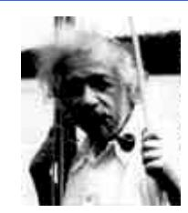
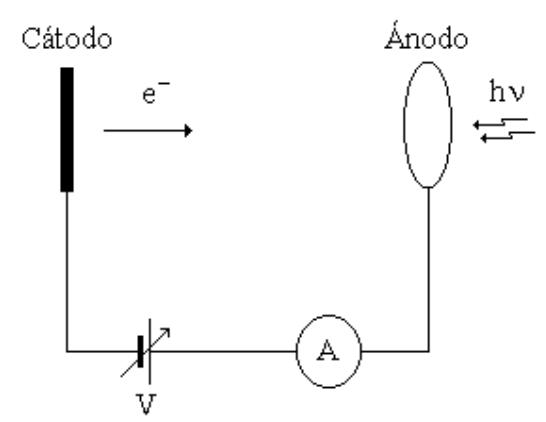
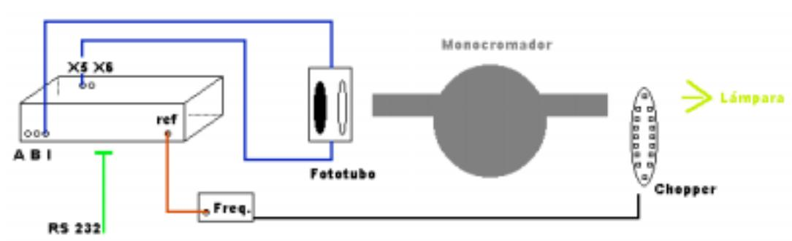
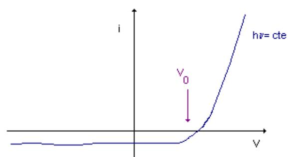
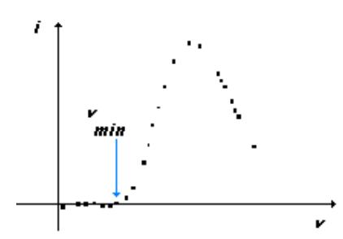
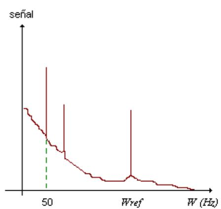

## Resumen

> Borrador inicial generado desde PDF con marker-pdf. Revisar y editar para fidelidad conceptual.

## Objetivos de aprendizaje

- (Completar con base fiel en la guía)
- (Completar con base fiel en la guía)
- (Completar con base fiel en la guía)

## Desarrollo conceptual del fenómeno

## **Introducción:**

 Cuando luz monocromática incide sobre un cátodo de material fotosensible, este emite electrones con una energía cinética que depende de la longitud de onda de la luz incidente y del tipo de material del cátodo. Este proceso se denomina emisión fotoeléctrica, y los electrones emitidos se denominan fotoelectrones. Determinando la energía de los fotoelectrones emitidos se puede evaluar la constante de Planck y la función trabajo del material del cátodo. En la práctica se intentará determinar ambas cosas. Supongamos que tenemos el dispositivo de la figura:

**Figura 1**. Diagrama esquemático del experimento para estudiar el efecto fotoeléctrico.

 El ánodo es un cable en forma de aro. Sobre el cátodo inciden fotones de energía *hν*. Los electrones se desprenden del cátodo salen con energía cinética *Te= hν -* φ donde φes el trabajo necesario para extraer un electrón del cátodo, es decir la energía necesaria para llevar un electrón hasta la superficie del cátodo con energía cinética nula. Si entre el ánodo y el cátodo ponemos una diferencia de potencial *V* negativa (frenador) entonces existirá un potencial *V0* tal que si *V<V0* el electrón no llegará al ánodo y no mediremos corriente en el amperímetro. Ese potencial *V0* satisface que:

*eV0 = hν -* φ φ (1)

 Vemos que si determinamos *V0* para distintas frecuencias *ν*, del gráfico de *V0* versus *ν* podemos en principio determinar *h* (la constante de Planck) a partir de la pendiente y φ de la ordenada al origen. Sin embargo, este método no es el más adecuado para determinar la función trabajo φ (a partir de la ordenada al origen) porque

### **Efecto Fotoeléctrico Cátedra de Laboratorio 5 Departamento de Física de la UBA**

en realidad el potencial *V0* es suma del potencial que uno mide entre el cátodo y ánodo y un potencial de contacto *Vc*. 1

 Un Procedimiento para determinar la función trabajo del cátodo podría ser el siguiente: sabemos que existe una frecuencia mínima *νmin* tal que si *ν<νmin* no llegará al ánodo ningún electrón por más grande que sea el potencial acelerador (dentro de ciertos límites). Para *νmin* la energía del fotón es justo la necesaria para arrancar el electrón del material pero sale con energía cinética cero. Si la frecuencia es mayor tendremos una corriente mientras que si es menor no habrá corriente por mas que pongamos un potencial acelerador. Para *νmin* podemos plantear la siguiente ecuación:

*hνmin=* φ (2)

 De esta ecuación podemos, en principio, determinar la función trabajo del material del cátodo.

 Los problemas prácticos que tienen estos métodos son que las fotocorrientes que debemos medir son muy pequeñas y en general el ruido que aparece es más grande que la misma corriente que queremos medir.

## **Arreglo Experimental:**

 Para poder medir las fotocorrientes en la práctica se usará un amplificador Lock-In. En la Figura 2 se puede observar un esquema del experimento que se puede realizar.

**Figura 2.** Arreglo Experimental. Las entradas A y B del Lock-In miden tensión, la entrada I esta preparada para medir corriente. La salida RS232 del Lock -In corresponde a una interfase con una computadora. Las salidas X5 y X6 (posteriores) son similares.

 Como fuente de luz se puede usar una lámpara de mercurio y/o una de tungsteno. La primera tiene un espectro discreto mientras que el de la lámpara de tungsteno es continuo. Para seleccionar una longitud de onda se pasa la luz a través de un monocromador de prisma. En el arreglo propuesto, la luz es obturada por un disco metálico con aberturas (chopper) que gira con velocidad angular constante *w0* conocida. Esto hace que la fotocorriente esté modulada a la misma frecuencia fija *w0*. La corriente producida por el fotocátodo se mide con un amplificador lock-in. El lock-in es esencialmente un filtro que deja pasar y amplifica sólo lo que esté a una frecuencia determinada (*w0*), es decir que podemos pensarlo como un filtro de banda angosta en serie con un amplificador. El amplificador tiene un convertidor analógico-digital que es controlado desde una computadora y que permite adquirir la corriente en función del

 1 Ver Referencias

tiempo. Además se puede variar el potencial de retardo entre el cátodo y ánodo desde la computadora mediante una salida analógica del lock-in a medida que medimos la fotocorriente. Para tener mas detalles acerca del funcionamiento y propiedades del amplificador lock-in que usarán en la práctica, es necesario que lean cuidadosamente el manual de instrucciones del instrumento que está disponible en el laboratorio.

 Si graficamos la fotocorriente en función del potencial de retardo se obtienen curvas del siguiente tipo:

**Figura 3**. Variación esquemática de la corriente en función del potencial retardador. Un modo de determinar *V0* consiste en encontrar por inspección ocular el primer punto donde se nota que la fotocorriente presenta un apartamiento de las fluctuaciones estadísticas.

 A partir de estas curvas, utilizando distintas longitudes de onda, se puede construir el grafico del potencial retardador *V0* en función de *ν* y de allí se determina *h*. Se puede ver que para potenciales de retardo grandes la corriente no es exactamente cero sino que es negativa. Esto se debe al hecho que puede haber depositado potasio (el material del cátodo) en el ánodo. Si la luz incide sobre el potasio depositado en el ánodo se pueden desprender electrones. Estos verán el potencial retardador (para los del cátodo) como acelerador produciendo una corriente negativa y además haciendo difícil determinar el potencial de corte *V0*.

 Para determinar la función trabajo del material se debe graficar la corriente medida como función de la frecuencia con un potencial acelerador fijo. Las curvas son del siguiente tipo:

**Figura 4**. Variación esquemática de la corriente en función de la frecuencia *ν* para un potencial aplicado constante *V*.

Utilizando la ecuación (2) se puede determinar la función trabajo φ.

### **Desarrollo de la Práctica:**

!"**Calibrar el monocromador**: Utilizando las líneas conocidas de la lámpara de mercurio, una lámpara de sodio y el láser se debe calibrar la escala del monocromador. Levantar una curva de calibración de frecuencia *ν* versus posición del dial, que usarán más adelante. Consultar con el docente sobre las precauciones con los tres tipos de fuentes.

!"**Determinar** *h*: Obtener las curvas de *I* en función de *V* para las líneas del mercurio y la lámpara de tungsteno para determinar *V0* y así *h*. !"**Determinar** φ: Obtener el gráfico de *I* en función de *ν* y determinar φ hallando *νmin*.

# **Apéndices**

# **Amplificador Lock-In**

 La medición usando amplificadores lockin es especialmente útil cuando estamos en presencia de señales muy pequeñas. Un amplificador lockin permite hacer mediciones limpias de señales muy pequeñas obscurecidas por ruido que puede ser miles de veces mayor que la señal misma. Esencialmente, un amplificador lockin consiste en un filtro pasabanda de ancho angosto, sintonizado con la frecuencia de la señal que queremos medir. Esta sintonía va a hacer que las frecuencias de ruido fuera del ancho de banda sean automáticamente filtradas. Valores típicos son ancho de banda de 0.01 Hz centrados a 10 KHz. Esto da un factor de mérito para el filtro de **ν/**∆**ν =**106 . Sumado a este efecto de filtro, el amplificador lockin es un amplificador que provee ganancia, amplificando la señal filtrada.

 La técnica de medición con lockin requiere que el experimento sea excitado a una frecuencia fija para producir una señal a esa frecuencia. El amplificador luego detecta la señal a la frecuencia dada con un ancho de banda angosto.

 El lock-in que se usará tiene dos entradas: por una entra la señal que se quiere medir modulada de alguna manera (Por ejemplo con el chopper). Por otro lado el lockin recibe una señal de referencia a la frecuencia que se quiere filtrar. El amplificador usa esta referencia para determinar que frecuencia debe dejar pasar y amplificar. Veamos como es el espectro típico (la descomposición de Fourier) de la señal de entrada que le llega al lockin:

**Figura 5**. Espectro en frecuencias típico de la señal de entrada.

 En la figura se puede ver que el ruido esta distribuido en todo el espectro. En algunos lugares puede ser más intenso que nuestra propia señal (por ejemplo en los 50 Hz y sus armónicos). Veamos que debe haber un pico en la frecuencia *w* que corresponde a lo que hayamos modulado. Si escogemos *w* de manera que en esa parte del espectro el ruido sea chico entonces el lockin sólo amplificará nuestra señal. Esto mismo no se hubiese podido lograr si lo único que hacemos es amplificar. En este caso amplificaremos todo: señal pero también ruido. Es importante recordar que de alguna manera tenemos que tratar de modular lo que nos interesa medir. Si por equivocación modulamos también el ruido no vamos a lograr mucho con el lockin.

# **Puesta a Punto del Lock-In**

Estos son los parámetros del Lock-In

#"**Signal Filters**: Son los tres tipos de filtro con los que cuenta el Lock-In. Para la práctica deben estar los tres activados ("in") #"**Sensitividad**: Se ajusta constantemente a lo largo de la practica, conviene tener siempre el mínimo valor posible sin que la señal sature (cuando esto ocurre se enciende una luz de Overload). #"**Dynamic Resolution**: Es el parámetro asociado con la etapa en que es realizado el filtrado. Para esta práctica debe estar la opción en Low. #"**Display**: Cuando se observa X el valor representa la medición de corriente. Si se hace una medición del ruido (noise), se puede estudiar la amplitud del mismo y analizar para que frecuencias del chopper este valor es mínimo (por ejemplo). #"**Expand** X1 #"**Rel** Off #"**Offset** Off #"**Time Constant**: Parámetro asociado con el tiempo de integración, típicamente es 1 segundo para tiempos de adquisición prolongados (mayores a 120 seg.) #"**Post** 1

Nota: la taza de adquisición de datos se ajusta mediante el programa de adquisición, el valor máximo en que puede adquirir es de 20 Hz.

### **Programa de Adquisición de Datos**

 El Programa se llama Lock-In, y presenta en su pantalla principal el siguiente panel de control:

| Run- Stop  | F1 | F2  | X-Y Format   |
|------------|----|-----|--------------|
| Select Y   | F3 | F4  | Store/Recall |
| Scale X    | F5 | F6  | Lockin Setup |
| Scale Y    | F7 | F8  | Program D/A  |
| Reset Scan | F9 | F10 | Other        |

Mediante la función Select Y (F3) se puede elegir que magnitudes medir (elijo V y una de las salidas X5 ó X6, de acuerdo al arreglo experimental).

Mediante la función Scale X puedo optar por la ventana de tiempo que voy a visualizar en pantalla (Display Window time entre 10 – 4500 s).

La función Program D/A permite variar los parámetros de la rampa de tensión que servirá como potencial retardador y acelerador durante la experiencia (salidas X5 ó X6).

Para una mejor visualización conviene emplear la opción de Escala en el eje Y (F7). Cuando la rampa de tensión alcanzó su valor máximo presionar F1 (Autoescale).

Presionando F1 inicio y detengo la adquisición, y mediante F4 almaceno los datos en el disco.

Otras funciones importantes se encuentran presionando F10 (Other), allí nos encontraremos con un panel del siguiente tipo:

| Smooth     | F1 | F2 | Printer     |
|------------|----|----|-------------|
| Calculator | F3 | F4 | Copy        |
| Autophase  | F5 | F6 | Cursor      |
| Autogain   | F7 | F8 | Exit to Dos |

Entre estas funciones la opción de Autophase es muy importante para obtener el máximo de señal que podemos medir.

Los archivos de salida del programa se reconocen por su extensión ".LID" (por ejemplo: labo5.lid). Para transformar estos archivos a un formato ASCII y poderlos analizar con cualquier planilla de cálculo se debe emplear el "Convert.exe"

## **Líneas Características**

Usadas para la calibración del monocromador.

| Mercurio: | azul     | 435.8 nm                      |
|-----------|----------|-------------------------------|
|           | verde    | 546.0 nm                      |
|           | amarilla | 576.9 nm y 579.0 nm           |
| Sodio:    | amarilla | 588.9 nm y 589.5 nm (doblete) |
| Láser:    | rojo     | 632.8 nm                      |

## **Referencias**

- 1. Harnwell-Livington, "*Experimental Atomic Physics*".
- 2. S.K.Chakarvarti & B.L. Sahrma, "*Determination of Planck's constant using the photoelectric effect*," Phys. Educ. **23,** 249 - 251 (1988).
- 3. J. H. Scofield, "*Frecuency-domain description of a lock-in amplifier*,"Am. J. Phys. **62**, 129 -133 (1994).
- 4. A.W. Knudsen, "*The photoelectric determination of h/e: A new approach to the problem,*" Am. J. Phys. **51**, 725 – 729 (1983).
- 5. R.A. Powell, "*Photoelectric Effect: Back to Basics*", Am. J. Phys. **46**(10), 1046 (Oct. 1978).
- 6. *approach to an old problem"* Am. J. Phys., Vol. 51, No. 8, August 1983, 725
- 7. Donald W. Boys, Mary E. Cox, William Mykolajenko- *"Photoelectric effect revisited (or an inexpensive device to determine h/e)"* - Am. J. Phys., Vol. 46, No. 2, February 1978 Pages 133
- 8. J. Rudnick, D. S. Tannhauser - *"Concerning a widespread error in the description of the photoelectric effect"* - Am. J. Phys., Vol. 44, No. 8, August 1976, 796

> Nota de revisión: validar manualmente ecuaciones, bloques matemáticos y notación física luego de la conversión automática.

## Ejes de exploración experimental

- (Revisar y reformular evitando formato receta)
- (Revisar y reformular evitando formato receta)
- (Revisar y reformular evitando formato receta)

## Preguntas orientadoras

- ¿(Completar)?
- ¿(Completar)?
- ¿(Completar)?

## Seguridad específica

- (Agregar normas y enlaces pertinentes)

## Recursos y referencias

- Texto de práctica: http://materias.df.uba.ar/l5a2023c1/files/2012/07/fotoelec.pdf

## Fuente original

- Conversión automática con marker-pdf (requiere revisión de sintaxis/formato).
- Fuente principal: http://materias.df.uba.ar/l5a2023c1/files/2012/07/fotoelec.pdf
