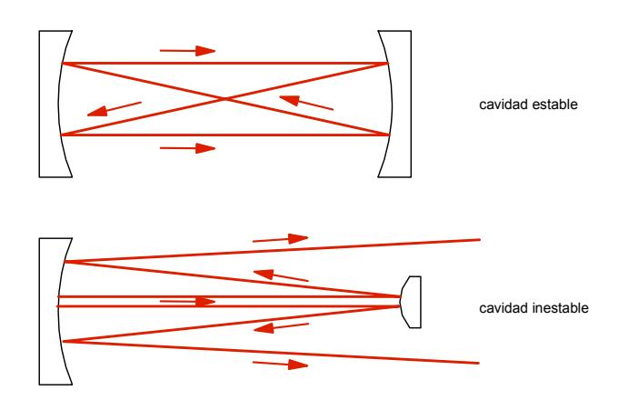
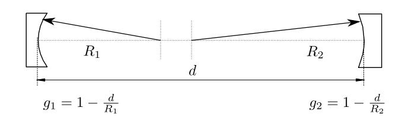
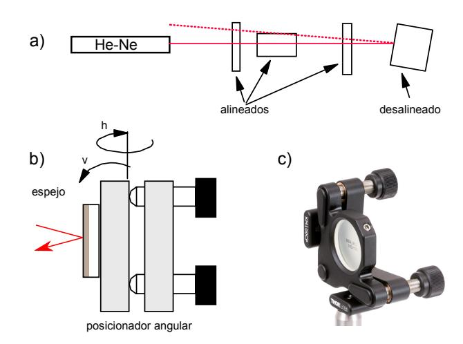
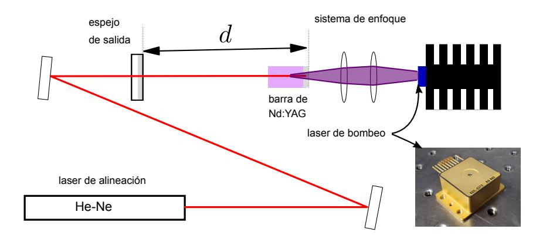
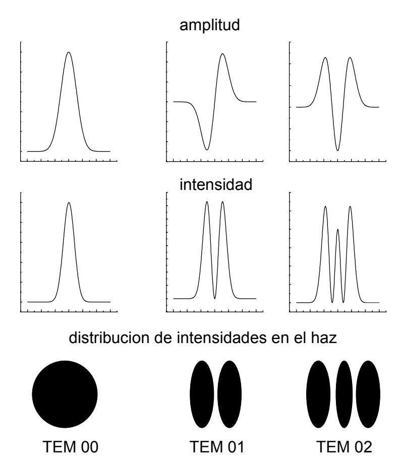
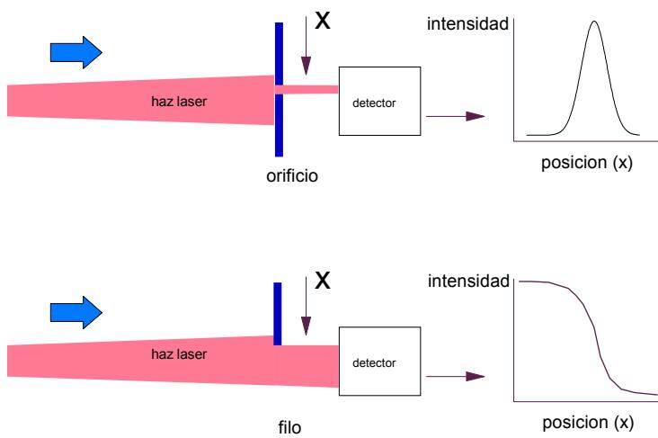
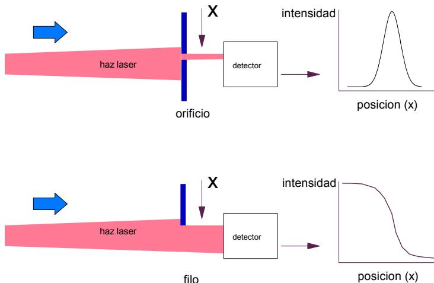

## Resumen

> Borrador inicial generado desde PDF con marker-pdf. Revisar y editar para fidelidad conceptual.

## Objetivos de aprendizaje

- (Completar con base fiel en la guía)
- (Completar con base fiel en la guía)
- (Completar con base fiel en la guía)

## Desarrollo conceptual del fenómeno

# I. L´aser de Nd:YAG. Cavidades y modos transversales.

LABORATORIO 5 Departamento de F´ısica - UBA.

Versi´on revisada febrero 2024

Un l´aser es un dispositivo optoelectr´onico capaz de emitir radiaci´on, generalmente en el rango UV-IR en forma de haz cohererente, cuasi colimado y altamente direccional. "L´aser" es un acr´onimo de las siglas en ingl´es *Light Amplification by Stimulated Emission of Radiation* (Amplificaci´on de Luz por Emisi´on Estimulada de Radiaci´on). Sus tres componentes principales son una cavidad resonante, un medio activo que relaja su excitaci´on en forma radiativa, y un medio para excitar al medio activo, que provee la energ´ıa al sistema, llamado bombeo. La cavidad ´optica rodea el medio con ganancia y provee realimentaci´on de la radiaci´on, para que el medio relaje a trav´es de emisi´on *estimulada*, antes que por emisi´on espont´anea (fluorescencia). El medio activo puede emitir radiaci´on por decaimiento de niveles electr´onicos, vibracioneales, etc. El mecanismo de bombeo puede ser ´optico (inyecci´on de luz), el´ectrico, o formas m´as ex´oticas como reacciones qu´ımicas o calor. En esta gu´ıa introductoria se repasan algunos aspectos te´oricos b´asicos de cavidades, y aspectos operativos de la pr´actica del Laboratorio.

## **1 Introducci´on**

En esta pr´actica se estudiar´an las condiciones de estabilidad en cavidades resonantes y las caracter´ısticas principales de un l´aser de Nd YAG [\[1\]](#page-7-0). Un l´aser est´a compuesto por tres componentes b´asicos: un mecanismo de bombeo, un medio amplificador y un medio de realimentaci´on. El mecanismo de bombeo puede ser muy variado (excitaci´on con un haz de electrones, mediante luz coherente -otro l´aser- o luz incoherente -una l´ampara de destello-, mediante una reacci´on qu´ımica, etc.). El bombeo es la forma que tiene el sistema de recibir la energ´ıa necesaria para sostener la emisi´on l´aser. El segundo componente primordial de un l´aser es el medio activo o medio amplificador. Este puede ser un medio s´olido (cristalino o amorfo), un l´ıquido o un plasma. El amplificador o medio activo es el que recibe la energ´ıa del bombeo y la "transfiere" al haz l´aser que genera. El ´ultimo elemento con que cuentan la mayor´ıa de los l´aseres que existen es un mecanismo para realimentar la radiaci´on (luz) y lograr emisi´on estimulada [ref estimulada] en el amplificador permitiendo de esta manera que el l´aser adquiera sus caracter´ısticas distintivas, que son su gran colimaci´on, alta coherencia y gran brillo. En el caso de luz, la realimentaci´on se logra mediante espejos que reinyectan una parte de la se˜nal nuevamente en el amplificador de luz.

Una cavidad resonante consiste en dos o m´as espejos alineados de manera tal que la luz emitida por el amplificador se refleje sobre s´ı misma, recorriendo el mismo camino ´optico muchas veces. Generalmente uno de los espejos de la cavidad resonante tiene una reflectividad menor que el 100%, de tal manera que parte de la luz que est´a oscilando salga de la cavidad, produciendo un haz colimado que es lo que llamamos la salida de nuestro l´aser.

Podemos armar diferentes cavidades resonantes, cambiando la configuraci´on de las mismas al variar la distancia entre espejos y sus radios de curvatura. En base a estas configuraciones, las cavidades resonantes se dividen en dos grandes grupos: cavidades estables y cavidades inestables. Las primeras tienen la particularidad de que la distribuci´on de intensidades dentro de la cavidad no se modifica en los sucesivos pasajes de la luz a trav´es de la cavidad. En las cavidades inestables el haz va divergiendo progresivamente y realiza pocos pasajes por el amplificador.

Las cavidades estables son las m´as comunes y se usan en todos los l´aseres que funcionan en forma continua. Las cavidades inestables son particularmente ´utiles en l´aseres que funcionan en forma pulsada con medios amplificadores de gran ganancia. Un ejemplo indicativo de cavidades estables e inestables junto con un posible trazado de rayos por la cavidad puede verse en el diagrama de la figura [1](#page-1-0)

- Enumere caracter´ısticas de cavidades estables e inestables

Figura 1: Esquemas t´ıpicos del comportamiento de un rayo de luz dentro de una cavidad estable y de una cavidad inestable

## **2 Cavidades Estables e Inestables**

Si armamos una cavidad resonante conformada por dos espejos de radios de curvatura *R*1 y *R*2 [2,](#page-1-1) separados por una distancia *d*, se puede demostrar que la cavidad ser´a estable s´ı:

0 ≤ *g*1*g*2 ≤ 1 (1)

donde hemos definido *gi* = 1−*d/Ri* . En cualquier otro caso la cavidad es inestable. Esta formula sencilla nos da un criterio r´apido para dise˜nar cavidades de dos espejos. Para sistemas m´as complejos, se puede ver el documento adicional de la pr´actica. En la formula anterior se considera que los espejos convergentes tienen radio de curvatura positivo.

- En un gr´afico *g*1 vs *g*2 encuentre las regiones donde las configuraciones son estables y donde son inestables

Figura 2: Configuraci´on de cavidad de dos espejos curvos separados una distancia *d*. Definici´on de los par´ametros *gi*

## **3 Enfoque del diodo l´aser**

En esta practica se va a utilizar un diodo l´aser como fuente de bombeo para un l´aser de Nd:YAG. Es decir, es un bombeo ´optico. Recurra al manual de la fuente del l´aser y siga las instrucciones de encendido para poner en funcionamiento el dispositivo. Aseg´urese de que el l´aser est´a funcionando dentro de los par´ametros normales que indica el manual.

El diodo l´aser, o l´aser semiconductor de bombeo tiene un sistema de enfoque compuesto por varias lentes (esf´ericas y cil´ındricas) que permite enfocar la radiaci´on de salida. El sistema de bombeo est´a dise˜nado para lograr una zona de enfoque peque˜na donde se concentra la energ´ıa de bombeo y donde se debe ubicar la barra de Nd:YAG. Este sistema complicado de enfoque est´a dise˜nado para compensar la fuerte asimetr´ıa espacial de los diodos l´aser utilizados como fuentes de bombeo, que est´an compuestos por muchas fuentes muy peque˜nas dispuestas en una l´ınea de manera que el haz emitido por estos dispositivos de alta potencia tiene forma alargada. Esto se traduce en valores muy diferentes de divergencia en las dos direcciones de propagaci´on (vertical y horizontal). Para lograr excitaci´on eficiente del l´aser que estamos bombeando, es necesario concentrar toda esta energ´ıa en una zona peque˜na lo menos oblonga posible, y por consiguiente se utiliza un sistema ´optico astigm´atico para compensan la asimetr´ıa de la fuente.

- Qu´e tipo de bombeo tiene el diodo l´aser?
- Por qu´e no usar directamente un l´aser semiconductor, en vez de usarlo para excitar al sistema de Nd:YAG?
- Qu´e longitudes de onda de emisi´on tiene cada uno de los l´aseres?

## **4 Alineaci´on de la cavidad**

En una cavidad estable los espejos est´an alineados de manera que las sucesivas reflexiones de la luz en cada unos de ellos vuelven sobre s´ı mismas, repitiendo en cada pasaje la misma distribuci´on de intensidades en cada punto de la cavidad. Para lograr esto es necesario alinear los espejos de la cavidad con mucho cuidado. Existen varios m´etodos que podemos emplear para alinear los espejos en una cavidad l´aser, tales como la utilizaci´on de auto-colimadores o telescopios. El m´etodo m´as c´omodo, sin embargo, es utilizar un l´aser de He-Ne como elemento auxiliar que nos permita alinear los espejos de la cavidad en que estamos trabajando mediante la superposici´on de las reflexiones del l´aser en los diferentes elementos ´opticos de la cavidad. Cuando los elementos ´opticos intercalados est´an alineados con el eje definido por el haz l´aser (es decir, sus superficies est´an ubicadas perpendiculares a la direcci´on de propagaci´on de la luz), las respectivas reflexiones volver´an sobre s´ı mismas, de lo contrario las reflexiones no se superpondr´an con el haz l´aser de referencia (ver figura [3.](#page-2-0)

Para alinear todos los elementos ´opticos, monte los espejos en posicionadores angulares que le permitan mover los ´angulos en la direcci´on vertical (v) y horizontal (h) en forma independiente. Estos montajes para espejos est´an provistos con tornillos de paso fino que permiten un control muy exacto de los dos ´angulos en forma independiente.

Figura 3: a) Esquema de alineaci´on, mostrando varios elementos alineados (reflexiones sobre el haz incidente) y uno desalineado. Posici´on angular de precisi´on; b) esquema y c) posicionador comercial.

IMPORTANTE: Un espejo es (incluso los de uso diario) un vidrio plano al que se lo recubre con un material reflectante, es decir que no absorbe pr´acticamente nada del espectro electromagn´etico de inter´es. Los espejos m´as comunes tienen un recubrimiento de plata o aluminio. En el espejo del ba˜no de su casa, el recubrimiento se ubica en la parte trasera del vidrio; as´ı se lo protege de impactos y suciedad. El inconveniente de esta configuraci´on es que siempre tendremos la reflexi´on en la primera cara del vidrio, que es del orden del 4% para luz visible en incidencia normal y un material de ´ındice de refracci´on *n* ≈ 1*.*5. Esta reflexi´on no es un problema para un espejo cosm´etico, pero para aplicaciones de ´optica precisa como la que nos encontramos discutiendo, esta primera reflexi´on es inaceptable. Entonces el recubrimiento se realiza en la primer cara (sobre la que incide la luz). Esto elimina reflexiones esp´ureas, pero convierte al espejo en un componente fr´agil. Hay que tener cuidado con su manipulaci´on y c´omo se limpia la superficie en la eventualidad de que ´esta se manche o se ensucie, o se le deposite polvo.

Los espejos que se usan para alineaci´on auxiliar (los que usaremos para el l´aser He-Ne) tienen recubrimiento reflectante met´alico (por eso se les dice *espejos met´alicos*). Los que sirven para armar la cavidad, los espejos para el l´aser, tienen recubrimientos diel´ectricos. Estos tienen mejor reflectividad para el rango de longitudes de onda especificado, son m´as resistentes al da˜no ´optico, y por ser muy

Figura 4: Alineaci´on de espejos de la cavidad: uno de ellos est´a sobre la barra, el otro es un espejo plano o curvo de salida. Los espejos auxiliares de alineaci´on son espejos met´alicos, que direccionan el l´aser He-Ne o diodo l´aser rojo en forma contrapropagante al haz l´aser esperado.

selectivos en longitud de onda, no siempre parecen espejos (s´olo reflejan radiaci´on en un rango acotado del espectro). Se los llama *espejos diel´ectricos*.

El medio activo del l´aser (la barra de Nd:YAG, que ya deber´ıa estar montada en un posicionador porque es un elemento delicado y de dif´ıcil reposici´on) ya tiene un espejo diel´ectrico depositado en su superficie exterior. Es un recubrimiento sofisticado, que transmite con alta eficiencia la radiaci´on del bombeo y refleja un 99.9% de la radiaci´on de la transici´on del Neodimio.

- Estime la precisi´on angular con la que puede alinear los espejos.
- D´onde conviene ubicar el l´aser de alineaci´on?

Arme la cavidad que muestra la figura [4,](#page-3-0) con el espejo plano de la barra de Nd:YAG y con un espejo plano de 98 o 99% de reflectividad (o un espejo curvo). Seg´un se vio anteriormente la condici´on de estabilidad de la cavidad depende del radio de curvatura de los espejos y de la distancia entre ellos. Para lograr alinear mas f´acilmente el l´aser optamos por una cavidad estable con un espejo de salida de alta reflectividad, lo que nos va a asegurar que el conjunto tenga un umbral de funcionamiento bajo y har´a m´as sencillo el procedimiento de alinear. Observe que el dispositivo que se arma, aparte de los dos espejos que forman la cavidad l´aser, cuenta con otros dos espejos auxiliares que dirigen el l´aser de He-Ne. En el proceso de alineaci´on, el eje de la cavidad est´a definido por el volumen excitado en la barrita de YAG, que proviene del enfoque del diodo l´aser. El eje de este peque˜no cilindro es el eje de la cavidad y el procedimiento de alineaci´on de los espejos consiste en ubicar los espejos de la cavidad con sus superficies perpendiculares a este eje. Para lograr esto es que se incluyen los dos espejos auxiliares, que permiten inicialmente alinear el haz del He-Ne con el eje definido por el volumen excitado. Observe que estos dos espejos dan todos los grados de libertad necesarios para hacer que ambos ejes coincidan. Una vez lograda esta alineaci´on, proceda a alinear los espejos siguiendo el procedimiento explicado anteriormente (o sea alineando las reflexiones del He-Ne en las diferentes superficies).

- Mida cuidadosamente el camino ´optico de la cavidad. Tenga en cuenta que el ´ındice de refracci´on del cristal YAG es *n* ≈ 1*.*82.
- Qu´e configuraci´on de cavidad se obtiene? Ub´ıquela en el gr´afico *g*1 vs *g*2. En qu´e influye el largo de la cavidad?

Una vez pre-alineado el l´aser, utilice la tarjeta infrarroja para comprobar que el l´aser est´e funcionando (recuerde que el l´aser YAG:Nd emite en infrarrojo cercano, con una longitud de onda central de 1.06 µm). Si no observa nada, es probable que est´e cerca pero no del todo, por lo que deber´a mover el espejo de salida del l´aser en una u otra direcci´on hasta que aparezca la mancha del l´aser. Si luego de algunos intentos no aparece nada, repita el proceso de alineaci´on con el l´aser rojo. Una vez obtenida la emisi´on l´aser, trate de medir la potencia de salida y optimice la alineaci´on buscando el m´aximo de la se˜nal en el medidor de potencia moviendo lentamente los espejos. Var´ıe la potencia de excitaci´on del l´aser semiconductor variando la corriente y mida simult´aneamente la potencia de salida del l´aser Nd:YAG. Obtenga una curva de eficiencia (potencia de salida en funci´on de la potencia de bombeo). El medidor de potencia calibrado

que est´a utilizando integra temporalmente la energ´ıa recibida. Por lo tanto podemos decir que tiene una resoluci´on temporal baja o lenta. Para estudiar las caracter´ısticas de la emisi´on en una escala de tiempos mas corta necesitaremos de un detector con una resoluci´on temporal mejor. Utilice un fotodiodo PIN que tiene una resoluci´on temporal en el rango de los nanosegundos para hacer un estudio mas detallado de las caracter´ısticas de la emisi´on del l´aser Nd:YAG. Como es un l´aser de emisi´on continua, es probable que no haya una din´amica temporal muy rica en el estado estacionario. Puede probar a interrumpir el haz l´aser dentro de la cavidad: esto anula el campo de emisi´on estimulada, y aumenta la inversi´on de poblaci´on en el medio activo (acumula energ´ıa), debido a que la extracci´on de energ´ıa por emisi´on estimulada que hace el campo (el haz l´aser) es muy eficiente. En esa situaci´on, con el material almacenando m´as energ´ıa que en el estado de emisi´on continua y sin campo, si retira (r´apidamente) el obst´aculo que bloquea la cavidad, deber´ıa poder apreciarse un transitorio de encendido del l´aser.

#### TENGA LA PRECAUCION DE ATENUAR FUERTEMENTE EL HAZ DE SALIDA, YA ´ QUE LOS FOTODIODOS RAPIDOS SON MUY DELICADOS Y PUEDEN DA ´ NARSE ˜ FACILMENTE CON UNA SE ´ NAL DE LUZ EXCESIVA. ˜

Adem´as de tomar esta precauci´on, aseg´urese de que est´a trabajando con una se˜nal de luz lo suficientemente peque˜na como para no saturar el detector. Los fotodiodos r´apidos entregan una se˜nal el´ectrica proporcional a la luz que reciben con gran resoluci´on temporal, dependiendo del modo en el que est´an siendo operados (fotovoltaico o fotoconductivo, amplificado o simplemente polarizado), para m´as detalles ver la Ref [\[2\]](#page-7-1). Para poder ver esta se˜nal utilice un osciloscopio conectado al fotodiodo.

- C´omo depende la potencia de salida del l´aser en funci´on de la corriente de excitaci´on en el diodo de bombeo?
- C´omo es la emisi´on l´aser en funci´on del tiempo?
- Eval´ue las p´erdidas que tiene la cavidad que acaba de armar y calcule el valor de la ganancia en el umbral.
- Discuta la eficiencia total del l´aser

En la cavidad que acaba de armar se han incluido dos espejos, uno de reflectividad m´axima (99.99%) que est´a depositado directamente en la cara posterior de la barrita de Nd:YAG y otro que usamos como espejo de salida de ≈99%. Por lo tanto en cada recorrido la luz dentro de la cavidad experimenta una p´erdida de un 1% causada por el espejo de salida y una ganancia o amplificaci´on dada por el medio activo. Cuando el l´aser est´a funcionando (cuando supera la condici´on de umbral), significa que la ganancia del medio activo es suficiente para compensar las p´erdidas de la cavidad. Se puede demostrar que la condici´on de funcionamiento del l´aser (condici´on de umbral) corresponde a una ganancia dada por [\[3\]](#page-7-2):

*γ*umbral = *α* − 1 2*l* ln *R*1*R*2*,* (2)

donde *l* es el largo de la barra de Nd:YAG y *R*1 y *R*2 las reflectividades de los espejos de la cavidad. El factor *α* tiene en cuenta otras p´erdidas por pasaje, principalmente por absorci´on y difracci´on.

## **5 Modos Transversales**

Estudiaremos los modos transversales de oscilaci´on de un l´aser continuo. Una cavidad resonante se forma cuando a un medio amplificador agregamos espejos a ambos lados para realimentar la radiaci´on. Debido al di´ametro finito de la barra de Nd:YAG y de los espejos, no se puede establecer una onda estacionaria de la forma de una onda plana entre los espejos, como suceder´ıa si los espejos tuviesen di´ametro infinito. Se puede demostrar que las posibles soluciones estacionarias para la distribuci´on de intensidades dentro de la cavidad resonante sin paredes (abierta, como la de un laser) son en este caso, una familia de funciones que llamamos TEM*pq* o "modos transverso electro magn´eticos de orden *pq*". Los ´ındices *p* y *q* son n´umeros enteros que indican el orden de los polinomios de Hermite que forman parte de la expresi´on anal´ıtica de la soluci´on. Una expresi´on general con la deducci´on detallada de estas funciones puede encontrarse en las referencias [\[4,](#page-7-3) [5\]](#page-7-4).

El modo m´as "bajo" es el modo TEM00, que corresponde a una distribuci´on gaussiana de intensidades en funci´on de la coordenada radial transversa, *r*. Modos superiores tienen distribuciones un poco m´as

Figura 5: Distribuci´on de amplitud del campo y de la intensidad de algunos modos TEM. Abajo se muestra en forma esquem´atica el aspecto de la mancha del haz.

complicadas, que incluyen polinomios de Laguerre si el sistema tiene simetr´ıa de revoluci´on en el plano transversal, o, m´as generalmente, combinaciones de los polinomios de Hermite para las dos coordenadas *x* e *y* o Estas soluciones se numeran con los sub´ındices *pq* que indican cu´antos ceros tiene la intensidad en una dada direcci´on. Como ejemplo en la figura [5](#page-5-0) se indican las amplitudes, intensidades y un esquema aproximado de la distribuci´on de intensidades en en el haz para los modos TEM00, TEM01 y TEM02 considerando un sistema cartesiano. Estos modos se obtienen para un medio laser sim´etrico en la direcc´on transversal a la direcci´on de propagaci´on del haz.

- Qu´e indicar´ıan los ´ındices pq si se refieren a las coordenadas cil´ındricas radiales (*ρ*) y ´angulo azimutal (*ϕ*)? (modos de Laguerre-Gauss

## **6 Medici´on del perfil de intensidad**

Arme una cavidad estable y ponga en funcionamiento el laser, optimizando la alineaci´on de los espejos para obtener m´axima potencia. Con la tarjeta para detectar infrarrojo, observe la distribuci´on de intensidad en el haz a varias distancias. ¿Qu´e observa? Se puede medir la distribuci´on transversal de intensidades del haz (perfil) utilizando un detector de potencia y una peque˜na abertura m´as chica que el tama˜no del haz. Desplazando la abertura y midiendo la potencia que pasa a trav´es de ella se puede muestrear la intensidad para cada posici´on de la abertura. De esta forma podemos graficar la distribuci´on de intensidades del haz en un corte transversal del mismo. Si en lugar de medir detr´as de una abertura, se mide la potencia que pasa cuando se desplaza un borde (filo) a trav´es del haz, en lugar de medir la potencia para cada punto, se mide una se˜nal que es proporcional a la integral de la distribuci´on de intensidades (ver figura [6\)](#page-6-0).

Figura 6: Medici´on del perfil de un haz: distintos m´etodos para obtener la distribuci´on de intensidad y la distribuci´on acumulada.

- Dise˜ne un experimento y mida el perfil de intensidades del haz utilizando alguna de las dos sugerencias anteriores.

Los diferentes modos tienen diferentes distribuciones de intensidades en el plano transversal a la direcci´on de propagaci´on del haz. Normalmente el laser opera en una superposici´on de todos los modos que est´en por encima del umbral con intensidades relativas que van disminuyendo a medida que aumenta el "orden" del modo. Por eso, el laser funcionar´a normalmente predominantemente en el modo TEM00 (el de menor umbral) a menos que forcemos la extinci´on de ese modo en forma externa haciendo que prevalezcan ordenes superiores. Eso se puede conseguir (es dif´ıcil!) introduciendo deliberadamente p´erdidas en forma selectiva dentro de la cavidad. Mientras est´a funcionando, introduzca dentro de la cavidad un alambre perpendicular (di´ametro ≈ 50 *µ*m) al eje de la misma, montado sobre alguna plataforma que permita una translaci´on suave y controlada a trav´es del haz.

Otra forma de realizar esto es desalineando ligeramente la cavidad (para hacer esto es preciso hacerlo con una cavidad que sea estable y no una cavidad plano-paralela, que es algo patol´ogica ya que est´a al l´ımite entre una cavidad estable y una inestable). Una posible cavidad para realizar este experimento es con un espejo de salida de *R* = 500 mm separado unos 350 mm del medio activo. Para entender y conocer si una cavidad es estable o no se recomienda la lectura del material de la pr´actica "Formalismo de Matrices *ABCD* etc, etc"

- ¿D´onde conviene colocar el alambre?
- Discuta brevemente qu´e di´ametro aproximado debe tener el alambre y si esta magnitud influye en los resultados que obtiene.
- ¿Importa si el alambre est´a horizontal o vertical?

## **Lectura adicional**

- B.E.A. Saleh and M.C. Teich. *Fundamentals of Photonics*. John Wiley & Sons, 2019 (recomendado).
- A. Yariv. *Quantum Electronics*. John Wiley & Sons, 1989 (muy bueno, puede resultar muy "cu´antico").
- A.E. Siegman. *Lasers*. University science books, 1986 (muy completo, dif´ıcil como primera lectura).

[1] Amnon Yariv. *Quantum electronics*. John Wiley & Sons, 1989, cap´ıtulo 10. [2] Thorlabs. Photodiode det36a2 manual. [https://www.thorlabs.com/drawings/](https://www.thorlabs.com/drawings/dc07496715007ee2-6A68E66E-E142-1833-1BEEA50327A872CB/DET36A2-Manual.pdf) [dc07496715007ee2-6A68E66E-E142-1833-1BEEA50327A872CB/DET36A2-Manual.pdf](https://www.thorlabs.com/drawings/dc07496715007ee2-6A68E66E-E142-1833-1BEEA50327A872CB/DET36A2-Manual.pdf), 2017. [3] Amnon Yariv. *Quantum electronics*. John Wiley & Sons, 1989, cap´ıtulo 9. [4] William T Silfvast. *Laser fundamentals*. Cambridge university press, 2004. [5] Bahaa EA Saleh and Malvin Carl Teich. *Fundamentals of photonics*. john Wiley & sons, 2019.

El diodo l´aser de bombeo es un equipo costoso y delicado. Es fundamental conocer el orden de encendido y apagado de su fuente. SI TIENE DUDAS PREGUNTE!! nadie inicia la cursada de Laboratorio 5 sabiendo c´omo se usa este equipo.

#### **ORDEN DE ENCENDIDO:**

- 1. Conectar el cable de alimentaci´on de la **fuente principal a la l´ınea (220 V-AC)**, y **la tierra** a la mesa o a **una masa** del laboratorio.
- 2. Controlar que **las fuentes auxiliares** est´en conectadas a la fuente principal, y ´estas a su vez tambi´en est´en conectadas a 220 V. (Una de ellas corresponde al **control de corriente de bombeo** y la otra al **control de temperatura** del diodo; verificar que est´en correctamente conectadas).
- 3. ENCENDER LAS DOS FUENTES AUXILIARES.
- 4. ENCENDER LA FUENTE PRINCIPAL, con el pulsador de **"encendido general"**.

**VERIFICAR QUE EL CONTROL DE CORRIENTE SOBRE EL DIODO ESTE´ EN EL M´INIMO** . (CORRIENTE LASER ≈ 0*.*00 A)

- 5. **HABILITAR LA CORRIENTE SOBRE EL DIODO**, con el pulsador de **"encendido diodo"**.

#### **ORDEN DE APAGADO:**

- 1. **DISMINUIR EL VALOR DE CORRIENTE** sobre el diodo l´aser hasta el m´ınimo **(CORRI-ENTE LASER** ≈ 0*.*00 **A)**.
- 2. **APAGAR EL DIODO**, con el pulsador **"encendido diodo"**.
- 3. **APAGAR LA FUENTE PRINCIPAL**, con el pulsador **"encendido general"**.
- 4. **ESPERAR APROXIMADAMENTE 10 MINUTOS** antes de apagar las fuentes auxiliares, para permitir el enfriado del equipo.
- 5. **NO DESCONECTAR LAS FUENTES NI LA TIERRA DEL EQUIPO.**

> Nota de revisión: validar manualmente ecuaciones, bloques matemáticos y notación física luego de la conversión automática.

## Ejes de exploración experimental

- (Revisar y reformular evitando formato receta)
- (Revisar y reformular evitando formato receta)
- (Revisar y reformular evitando formato receta)

## Preguntas orientadoras

- ¿(Completar)?
- ¿(Completar)?
- ¿(Completar)?

## Seguridad específica

- (Agregar normas y enlaces pertinentes)

## Recursos y referencias

- Texto de práctica: http://materias.df.uba.ar/l5a2024c1/files/2024/03/I-Guia_Laser-labo_5.pdf

## Fuente original

- Conversión automática con marker-pdf (requiere revisión de sintaxis/formato).
- Fuente principal: http://materias.df.uba.ar/l5a2024c1/files/2024/03/I-Guia_Laser-labo_5.pdf
