## Resumen

> Borrador inicial generado desde PDF con marker-pdf. Revisar y editar para fidelidad conceptual.

## Objetivos de aprendizaje

- (Completar con base fiel en la guía)
- (Completar con base fiel en la guía)
- (Completar con base fiel en la guía)

## Desarrollo conceptual del fenómeno

# Guía: práctica de muones

### **Introducción**

En agosto de 1912, el físico austriaco Victor Hess realizó un histórico vuelo en globo que abrió una nueva ventana al estudio de la materia en el universo. Al ascender a 5300 metros, midió la tasa de ionización en la atmósfera y descubrió que esta aumentaba aproximadamente tres veces con respecto al nivel del mar. Concluyó que la radiación penetrante entraba en la atmósfera desde arriba. Había descubierto los rayos cósmicos.

Estas partículas de alta energía que llegan del espacio exterior son principalmente protones (89%) — núcleos de hidrógeno –, pero también incluyen núcleos de helio (10%) y núcleos más pesados (1%), hasta llegar al uranio. Al llegar a la Tierra, colisionan con los núcleos atómicos en la atmósfera superior, creando más partículas, principalmente piones. Los piones cargados pueden desintegrarse rápidamente, emitiendo partículas llamadas **muones**. A diferencia de los piones, estos no interactúan fuertemente con la materia y pueden viajar a través de la atmósfera para penetrar bajo tierra. La velocidad a la que llegan los muones a la superficie de la Tierra es tal que aproximadamente uno por segundo atraviesa un volumen del tamaño de la cabeza de una persona. [1]

### **Paradoja de los muones: corroboración de la teoría de la relatividad especial.**

La velocidad de los muones generados en la ionósfera (a una altura aproximada de 10 km) es de aproximadamente 0.98c y su tiempo de vida media es 1,56 µs. El tiempo de vida media es aquel para el cual la población baja a la mitad, de modo que . Es decir, según la teoría clásica, la tasa de supervivencia de aquellos que llegan a la superficie terrestre es de 0,3 de cada un millón de muones. Sin

Sin embargo, desde el punto de vista de un observador en la tierra, el tiempo del muón se dilata en un factor γ (aproximadamente igual a 5), de modo que la vida media medida es de 7,8 µs, dando como resultado un 5% de supervivencia. Desde el punto de vista del muón, vale la contracción de longitudes, con lo cual la distancia a la superficie se ve disminuida en un factor γ. [2]

[1]<https://home.cern/science/physics/cosmic-rays-particles-outer-space> [2]<http://www.hyperphysics.phy-astr.gsu.edu/hbase/Relativ/muon.html>

## **Propuestas experimentales**

A continuación se presenta una lista de propuestas de experimentos a seguir para caracterizar al sistema, familiarizarse con las mediciones y optimizarlas:

- Familiarizarse con el equipo y ver señales de los detectores individuales en el osciloscopio
- Apilarlos y observar coincidencias dobles (y triples) ¿Cuál es la frecuencia? ¿Qué es lo que sucede en cada uno?
  - ¿Cambia la frecuencia de las coincidencias al ponerlos uno al lado del otro en vez de apilarlos?
  - ¿Qué pasa si uno los separa?
- Cuando un muón atraviesa los centelleadores, ¿Siempre se lo detecta?
  - ¿Cómo mediría la eficiencia para cada módulo?
    - (Ayuda) ¿Cómo puedo garantizar que un muón atravesó uno de los detectores y usar esta información para medir la eficiencia (fracción de veces que lo ve sobre la cantidad de muones que lo atraviesa?
- ¿Cómo mediría el flujo de muones en función del ángulo con respecto al suelo?
  - ¿Qué distribución tiene?
- Los pulsos del PMT pueden ensancharse, para por ejemplo, bajar la frecuencia de sampleo y lograr ver tiempos más largos, así tener la posibilidad de medir tiempos de vida del orden del microsegundo.
- Luego de estudiar la forma estándar de acomodar los centelleadores (en el contexto de centelleadores de muestreo, se lo llama material activo porque genera las señales) y placas de algún material denso (material pasivo, frena a las partículas incidentes), se pueden buscar formas de acomodarlos distinto para maximizar los eventos en los cuales se sensa un decaimiento y se puede medir la vida media es. Por ejemplo, ordenar los tres centelleadores horizontalmente (para maximizar el área de sensado) y ubicar una plancha de algún material por arriba o por debajo.

Links

Cursos anteriores UBA:

[Curso-Fermi-Lab](http://materias.df.uba.ar/labo5a2013v/files/2013/02/curso-Fermi-Lab.pdf) [Centelladores](http://materias.df.uba.ar/labo5a2013v/files/2013/02/Centelladores.pdf)

### PSI:

[Software para PSI \(placa de adquisición\)](https://www.psi.ch/en/ltp-muon-physics/software-download) [Manual PSI](https://www.psi.ch/sites/default/files/import/drs/DocumentationEN/manual_rev51.pdf) [DRS4 Evaluation Board](https://www.psi.ch/en/ltp-muon-physics/evaluation-board)

Material técnico:

[Fuente BERTAN HV](https://www.spellmanhv.com/en/high-voltage-power-supplies/PMT)

[opamps de los preamplificadores](https://www.rocelec.com/part/01t4w00000PP7vRAAT-HFA1130IP?srsltid=AfmBOoqu8GdaXfXwd4Sl5xUXOdCbYKqSjy_Xp-IN8aK8a_L5jGpWyf7c)

[TAC módulo NIM \(Biased Time to pulse height converter\)](https://virgilio.mib.infn.it/brofferio/didattica/datasheet/ortec_457_TACManual.pdf) 

## Módulos centelladores por dentro

### **Los módulos tienen tres partes: CENTELLEADOR + PMT + PREAMP**

- Centellador: produce luz cuando lo atraviesa una partícula ionizante
- PMT (fotomultiplicador): produce una corriente cuando recibe luz
- PREAMP: amplifica la corriente producida por el PMT

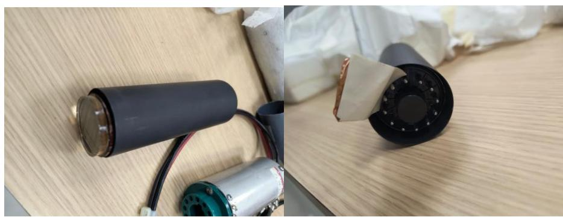

PMTs (adelante, atrás)

### Detalles etiqueta base/conector/preamp+PMT:

- BA PMT BASE UCLA P-307 S/N 072
- BA PMT BASE UCLA P-307 S/N 038 ch 59-bad base high dc offset
- BA PMT BASE UCLA P-307 S/N 054

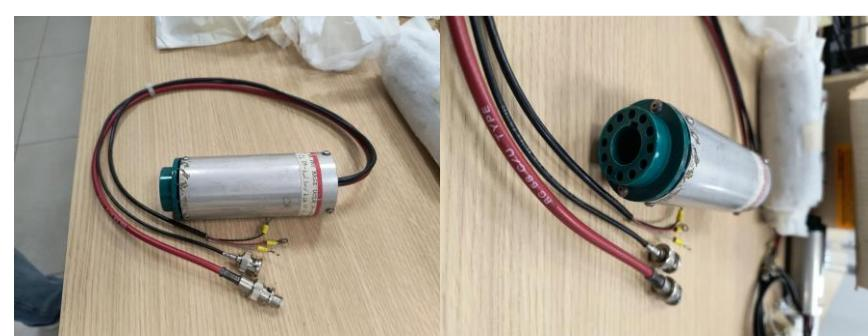

Los preamplificadores están dentro de las bases a las que se conectan los PMTs

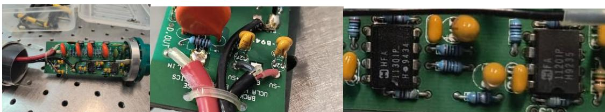

Base abierta. Vista del preamp

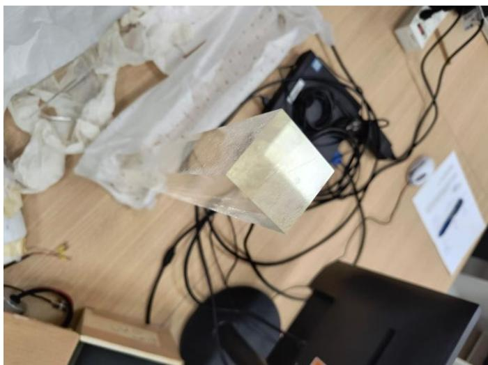

Centelleador acrílico: prisma de 4.5 x 4.5 x 46 cm

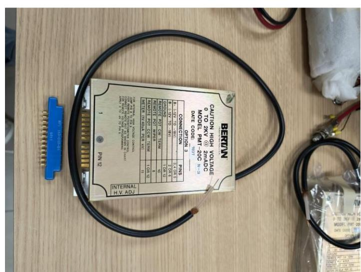

Fuente de HV Bertan 0-2 kV 2 mADC. Están dentro del gabinete.

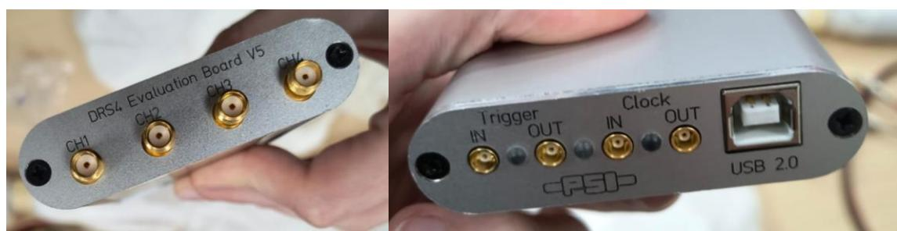

Placa de adquisición PSI para automatizar la toma de datos

# Módulos

Los módulos están protegidos dentro de una caja armada con 4 placas de madera fibrofacil, 2 tapas de madera (maciza) cuadradas y las paredes clavadas a cada tapa.

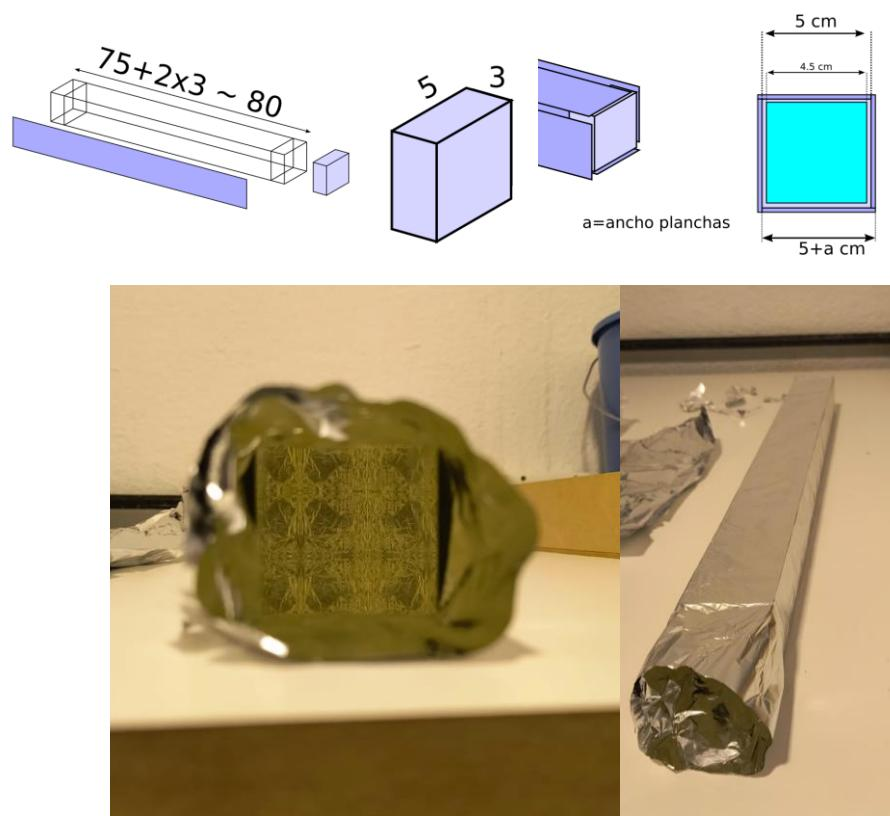

Los centelleadores están recubiertos en papel aluminio para que no les entre luz.

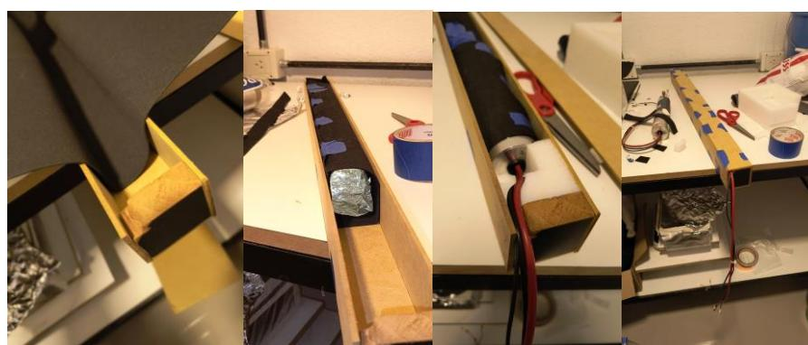

Entre los centelladores y la caja se agregó goma espuma negra en planchas finas para protegerlos.

Fuentes de HV para los PMT y de bajo voltaje para los pre-amp

- Los opamps de cada PMT están bien conectados, es decir, el voltaje +-5 lo dicta el color de los cables. si se abre, en el panel están escritos al revés el +5V y -5V, ignorar lo que está escrito. **(en resumen: rojo es V+, negro es V-).**
- Los 3 PMT tienen polaridad negativa,respuesta rápida, del orden de los nano s.
- Las fuentes de alta tensión están a -1500 V cada una. Se pueden monitorear en los puntos de prueba que reducen el voltaje en un factor 1000 (deberían medir -1.5V)

En la caja hay dos fuentes de alta tensión, tienen 12 pines cada una y se encuentran conectadas.

Modelo: PMT-20 C-P,N

Output : **0-2 kV / 0-2 mA** Ripple Vpp: 2mV Input: **±12Vdc to ±18Vdc @ 400mA**

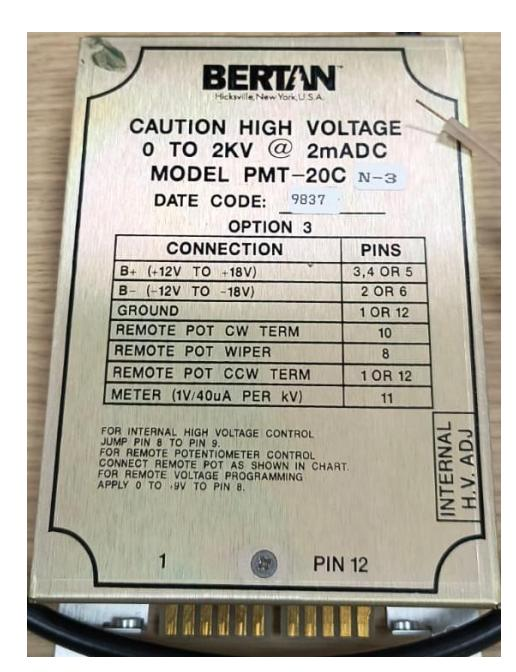

1) ground

2) Input - 12Vdc to -18Vdc @ 400mA

3) Input + 12Vdc to +18Vdc @ 400mA 4) Input + 12Vdc to +18Vdc @ 400mA

5) Input + 12Vdc to +18Vdc @ 400mA

6) Input -12Vdc to -18Vdc @ 400mA 7)

8) remote potentiometer-> wiper (0 to 9Vdc = 0 to 100% rated output, 100kΩ Zin)

9) (jump to 8 for INTERNAL HV ADJ) Internal program potentiometer wiper, 0 to 9Vdc

10) remote potentiometer -> Clockwise term (reference +9.0Vdc, 10mA maximum)

**11) Monitor (1V/40uA PER kV) Voltage/Impedance (0-2 V / 25 kOhms) (The Voltage Monitor polarity matches the high voltage output polarity )**

12) remote potentiometer -> Counterclockwise term / ground

La forma de setear el voltaje de las fuentes es mediante un control interno, con un destornillador plano. Otra forma de usarlo: control mediante "potenciómetro remoto":

# Pulsos característicos

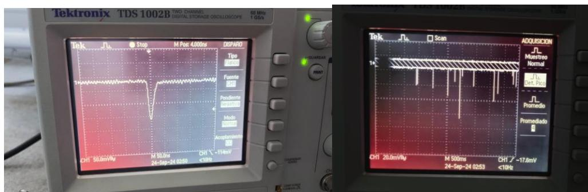

Pulsos medidos con osciloscopio.

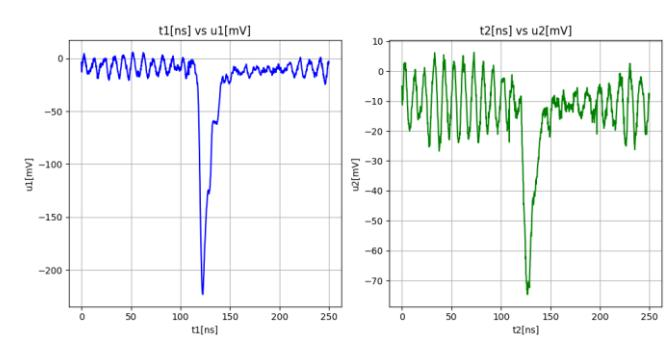

Pulsos con ruido.

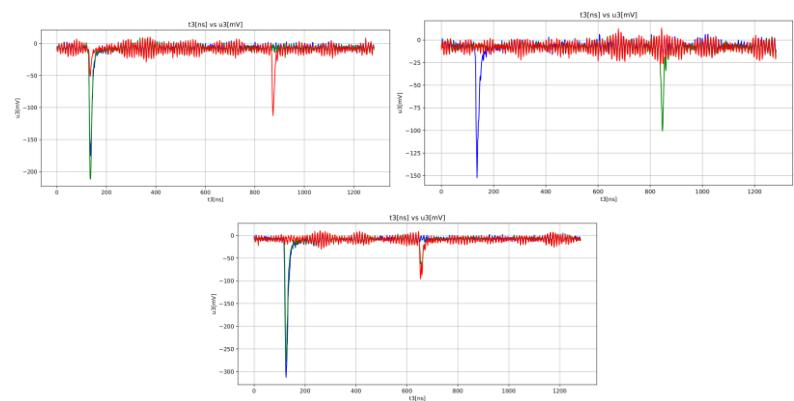

Ejemplo de pulsos en los que se ven posibles decaimientos de muones.

> Nota de revisión: validar manualmente ecuaciones, bloques matemáticos y notación física luego de la conversión automática.

## Ejes de exploración experimental

- (Revisar y reformular evitando formato receta)
- (Revisar y reformular evitando formato receta)
- (Revisar y reformular evitando formato receta)

## Preguntas orientadoras

- ¿(Completar)?
- ¿(Completar)?
- ¿(Completar)?

## Seguridad específica

- (Agregar normas y enlaces pertinentes)

## Recursos y referencias

- Texto de práctica: http://asignaturas.df.uba.ar/l5-tiffenberg/wp-content/uploads/sites/76/2025/08/practica_muones.pdf

## Fuente original

- Conversión automática con marker-pdf (requiere revisión de sintaxis/formato).
- Fuente principal: http://asignaturas.df.uba.ar/l5-tiffenberg/wp-content/uploads/sites/76/2025/08/practica_muones.pdf
