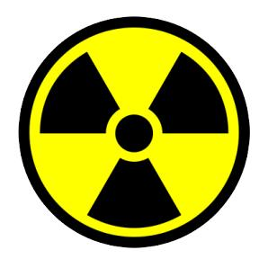
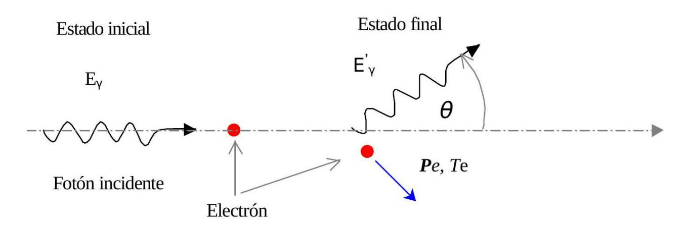
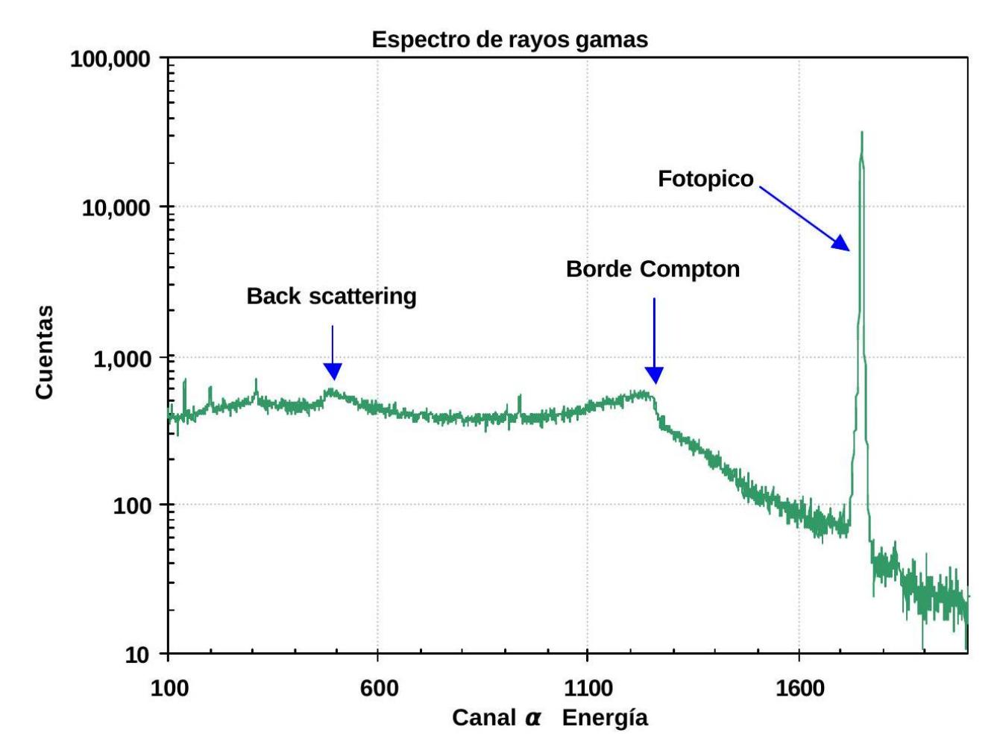
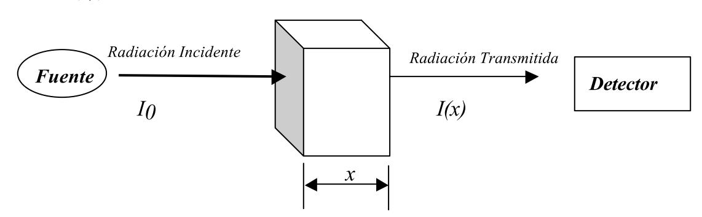
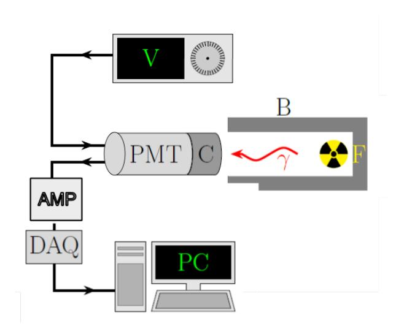

## Resumen

> Borrador inicial generado desde PDF con marker-pdf. Revisar y editar para fidelidad conceptual.

## Objetivos de aprendizaje

- (Completar con base fiel en la guía)
- (Completar con base fiel en la guía)
- (Completar con base fiel en la guía)

## Desarrollo conceptual del fenómeno

# Guía de Radiación Nuclear

Departamento de Física, Facultad de Ciencias Exactas y Naturales, Universidad de Buenos Aires Actualización: 2c 2025

Adaptación de Guía de Laboratorio 5 escrita por Salvador Gil. Colaboradores: Gabriela Pasquini, Muriel Bonetto, Natalia Philips, Nicolas Torasso

#### Resumen

La radiación nuclear es un fenómeno físico que involucra la emisión de partículas α, β o γ, originadas en un decaimiento atómico. Uno de los objetivos de este experimento es la obtención de espectros de radiación γ y su uso para el estudio del efecto Compton surgidos de la interacción de rayos gama con electrones. Este experimento permite comparar modelos clásicos y relativistas y determinar la masa en reposo del electrón. El otro objetivo es la investigación de la naturaleza estadística del decaimiento radioactivo. Se propone analizar si las emisiones en una dada ventana temporal obedecen una distribución de Poisson, incorporando al análisis de datos el método de χ 2 y el estudio de los momentos principales de la distribución. Adicionalmente, se propone estudiar la fenomenología de la interacción entre la radiación γ y X con la materia. De qué forma se atenúa al atravesar un material y cómo depende de la energía y el número atómico de los elementos radioactivos.

## Índice

| 1. 2. | Espectros de rayos γ y efecto Compton 1.1. Detección de radiación γ 1.2. Efecto Compton 1.3. Espectros de rayos γ Naturaleza estocástica del decaimiento radioactivo | 2 2 2 4 4 |
|-------|----------------------------------------------------------------------------------------------------------------------------------------------------------------------|-----------|
|       | 2.1. Introducción                                                                                                                                                    | 4         |
|       | 2.2. Distribución de Poisson                                                                                                                                         | 5         |
| 3.    | Interacción de la radiación electromagnética con la materia                                                                                                          | 6         |
| 4.    | Dispositivo experimental y procedimientos sugeridos                                                                                                                  | 6         |
|       | 4.1. Espectros de rayos γ                                                                                                                                            | 7         |
|       | 4.2. Naturaleza estocástica del proceso radioactivo                                                                                                                  | 7         |
|       | 4.3. Interacción de la radiación con la materia                                                                                                                      | 9         |

### 1. Espectros de rayos γ y efecto Compton

#### 1.1. Detección de radiación γ

El objetivo de las técnicas espectroscópicas es la determinación de las energías e intensidades de los fotones incidentes provenientes de algún fenómeno. En este caso estudiaremos los espectros de radiación γ. Los rayos γ se producen mayormente por desexcitación de un nucleón de un nivel o estado excitado a otro de menor energía y por desintegración de isótopos radiactivos [\[1\]](#page-9-0). Su emisión es por lo tanto intrínsecamente estocástica y su frecuencia media depende de la probabilidad de que se produzca una determinada transición y de la actividad particular de cada fuente radioactiva.

La forma que tenemos de detectarlos es a través de su interacción con un detector. El detector a utilizar en este tipo de experimentos puede ser un detector de estado sólido como germanio de alta pureza Ge(Hp) o bien un centellador del tipo NaI(Tl) [\[2\]](#page-9-1). Este último consiste de un centellador inorgánico de ioduro de sodio dopado con talio. Los fotones incidentes interactúan con los átomos del detector a través de distintos mecanismos [\[2\]](#page-9-1):

Efecto fotoeléctrico: cuando el fotón incidente entrega toda su energía a un electrón ligado a un átomo. El electrón eyectado adquiere una energía igual a la del fotón incidente, menos la energía de ligadura al átomo, que en estos casos es despreciable. Efecto Compton: aquí tenemos en el estado final un electrón libre y otro fotón, entre ambas partículas se reparten la energía del fotón incidente. Creación de pares (si Eγ > 1022 keV): en este caso, la energía del fotón incidente se emplea en generar un par electrón-positrón, que se reparten entre sí la energía del fotón incidente.

En estas interacciones la energía de los fotones incidentes se degrada dentro del detector en distintos tipos de excitaciones del material que forma el detector. Los electrones producidos en los distintos mecanismos de interacción excitan a la red cristalina induciendo la emisión de fotones ópticos, por lo que la información de la energía de las distintas partículas después de su interacción a través de los procesos mencionados anteriormente queda contenida en el número de fotones ópticos que emite el centellador. Estos fotones visibles inciden sobre el fotocátodo de un tubo fotomultiplicador (PMT) y producen a su vez la emisión de electrones por efecto fotoeléctrico. Estos electrones son acelerados y dirigidos hacia una serie de electrodos llamados dínodos [\[2\]](#page-9-1). Al chocar los electrones contra los dínodos, se producen más electrones por emisión secundaria, que son nuevamente acelerados y dirigidos hacia otros dínodos, y así sucesivamente, consiguiéndose un efecto multiplicador. El número de electrones expulsados en cada colisión depende de la tensión aplicada al PMT. De esta forma la salida del fotomultiplicador entrega una corriente electrónica proporcional al número de electrones, que se traduce en un pulso de tensión cuya amplitud es proporcional a la energía depositada en el detector por la radiación original y depende de la tensión aplicada al PMT.

A tensión aplicada al PMT fija, un histograma de la cantidad de pulsos recibidos en función de su amplitud relejará el espectro de energía resultante. Este espectro va a contener el resultado de todas las interacciones de la radiación incidente con el detector en cuestión. Vamos a ver un poco más en detalle la física involucrada en estas interacciones.

### 1.2. Efecto Compton

Cuando un fotón interactúa con un electrón libre, para que se conserve la energía y momento en la interacción, en el estado final debemos tener un electrón y un nuevo fotón entre los cuales se reparten la energía y el momento del fotón incidente [\[3\]](#page-9-2). Este efecto también se produce con electrones cuasilibre, o sea aquellos que tienen una energía de ligadura al átomo mucho menor que la energía del fotón incidente. En la Figura [1](#page-2-0) se presenta un diagrama esquemático de este proceso.

Llamamos Pe y Te al momento y energía cinética del electrón después de la interacción. Designamos con Eγ la energía del fotón incidente y con E′ γ (θ) la energía del fotón después de la interacción, que suponemos sale en una dirección que forma un ángulo θ con la dirección del fotón incidente. Para el

Figura 1: esquema de una interacción Compton.

caso particular de una colisión unidimensional, es decir, para el caso en que θ = 180◦ , de la conservación del momento y energía es fácil demostrar que:

Pec = 2Eγ − Te (1)

Esta relación es válida tanto relativísticamente como clásicamente. (demuestre la validez de esta última afirmación y obtenga la Ec.(1)).

La conexión clásica entre energía y momento es:

Te = P 2 e 2 · mnr (2)

Aquí mnr es la masa no relativista del electrón y Te es su energía cinética. Combinando (1) y (2) tenemos:

mnrc 2 = (2Eγ − Te) 2 2Te (3)

Esta expresión permite obtener la masa no relativista del electrón en la aproximación clásica, en términos de la energía del fotón incidente y la energía cinética máxima de los electrones después de una interacción Compton.

Por otro lado, la expresión relativista entre el momento y la energía cinética es:

Te = Ee − mec 2 = p P2 e c 2 + m2 e c 4 − mec 2 (4)

donde me es la masa en reposo del electrón. En esta expresión, Ee es la energía total del electrón. Si combinamos las expresiones (1) y (4) obtenemos:

me · c 2 = 2 · Eγ · (Eγ − Te) Te (5)

Esta ecuación es la análoga a la expresión (3) obtenida usando la relación relativista entre la energía y momento del electrón Ec.(4).

Los parámetros: β = v/c, γ = 1/ 1 − β 2 1/2 y Ee = P 2 e · c 2 + m2 e c 4 1/2 pueden escribirse en término de los parámetros Te y Eγ como:

β = Te · (2 · Eγ − Te) T2 e − 2 · Eγ · Te + 2 · E2 γ (6)

γ = 1 + T 2 e 2Eγ (Eγ − Te) (7)

Ee = T 2 e − 2EγTe + 2E2 γ T (8)

#### 1.3. Espectros de rayos γ

En la Figura [2](#page-4-1) se puede observar un espectro típico de rayos gama, obtenido con un detector de estado sólido. Los espectros que resultan de un detector de centelleo son en esencia similares, excepto que la resolución de los picos es menor a la ilustrada en la Figura [2.](#page-4-1) Las principales características de un espectro gama son el fotopico (corresponde al caso en que toda la energía del fotón incidente queda en el detector) y una planicie o meseta Compton. Esta planicie se debe a que, cuando ocurre una interacción Compton, el electrón deja toda su energía en el detector, mientras que el fotón producido en la interacción se escapa del mismo. Por esta razón la planicie siempre aparece a energías menores que el fotopico. La relación entre la importancia relativa de la meseta Compton y el fotopico depende entre otros factores del tamaño del detector. Cuando más grande sea el tamaño del mismo, menor será la probabilidad de escape de los fotones secundarios y menor será la magnitud de la meseta Compton respecto del fotopico. El continuo de la meseta se debe a que la energía de los electrones eyectados por la interacción, varía según sea el ángulo en que sale el fotón secundario. En particular, si el fotón secundario escapa a θ = 180◦ de la dirección incidente, el electrón eyectado tendrá la máxima energía posible en este tipo de interacción. En otras palabras, el valor de energía máxima de la meseta Compton, llamada borde o canto Compton, esta asociado a la energía máxima impartida a un electrón en una interacción Compton. La razón por la que el canto Compton no es abrupto, está asociado entre otras cosas a las limitaciones de resolución del detector. La presencia de cuentas entre el borde Compton y el fotopico está asociado a la posibilidad de que los fotones producidos en una interacción Compton realicen una segunda o tercera colisión Compton en el detector. En los espectros con varios fotopicos, se forma un fondo Compton que incluye todas las mesetas Compton de los fotopicos de mayor energía. El fondo puede además tener contribuciones de le electrónica, y de la radiación espuria. Una discusión más detallada de los distintos tipos de interacciones que ocurren en los detectores de rayos gama puede encontrarse en la referencia [\[2\]](#page-9-1).

De la discusión anterior, podemos concluir que del estudio de los espectros de rayos gama obtenidos usando detectores de estado sólido o centelladores podemos estudiar la cinemática y dinámica de la interacción de los fotones con los electrones del detector. Más específicamente, la energía de fotopico del espectro de rayos gama está asociada a la energía de los fotones incidentes (E⋎) mientras que la energía asociada al borde Compton es la energía máxima de los electrones eyectados en la interacción, o sea es la energía de los electrones que realizan una colisión unidimensional con los fotones incidentes y que en la ecuación (1) designamos con T. De este modo, un experimentos posible consiste en estudiar experimentalmente la relación ente Eγ y T. Una pregunta interesante que podemos tratar de contestar a partir de los espectros medidos es si la aproximación clásica alcanza para describir la dinámica del electrón eyectado en un proceso Compton en el centellador, o si es necesario incluir correcciones relativistas.

### 2. Naturaleza estocástica del decaimiento radioactivo

#### 2.1. Introducción

El decaimiento individual de un núcleo o átomo es un proceso estocástico [\[4,](#page-10-0) [5,](#page-10-1) [1\]](#page-9-0). La emisión de fotones por ejemplo, se realiza en forma aleatoria emitiendo radiación en dirección y tiempos no predecibles microscópicamente. No obstante, cuando tenemos un ensamble macroscópico (> 1012) de átomos que decaen, se puede determinar el número promedio de decaimientos en una dada dirección. Determinaciones sucesivas del número de cuentas, emitidas por una fuente radioactiva en un dado intervalo de tiempo, no darán exactamente el mismo resultado. Esta falta de definición o determinismo, es una de las características intrínseca del proceso radioactivo. Los valores obtenidos estarán distribuidos alrededor de un cierto valor medio <n>. El objetivo de este experimento es precisamente estudiar la distribución estadística asociada al decaimiento radioactivo.

Por la teoría de probabilidades [\[4,](#page-10-0) [6\]](#page-10-2) sabemos que si conocemos una función de distribución, conocemos todos los momentos de la misma. Recíprocamente, si de una distribución conocemos todos los momentos, esto es equivalente a conocer la distribución. Por lo tanto para determinar una distribución de probabilidad asociada a una experimento, tenemos dos alternativas: buscar la función de distribu-

Figura 2: espectro típico de rayos γ. Este caso corresponde a una fuente monoenergética, obtenida usando un detector de estado sólido Ge(Hp). Además del pico principal (fotopico) se observan dos singularidades características: el borde Compton, que corresponde a la máxima energía de los electrones en una colisión frontal con los fotones incidentes y el pico de back scattering, que corresponde a la energía de los fotones que fueron retrodispersados en algún lugar fuera del detector y luego deposita toda su energía dentro del mismo. Nótese que la escala vertical de este espectro es logarítmica.

ción que mejor ajuste la distribución de los datos, y/ o determinar los momentos más relevantes de la distribución de los datos y compararlos con los correspondientes a las de las funciones de distribución candidatas a dicho ajuste.

En este experimento queremos investigar si la estadística del decaimiento radioactivo puede describirse a través de una distribución de Poisson.

### 2.2. Distribución de Poisson

La distribución de Poisson es una distribución de probabilidad discreta, que caracteriza la probabilidad de soluciones a experimentos aleatorios en que los resultados posibles son el conjunto de los números naturales. La probabilidad de que la variable aleatoria tome el valor n está dada por la función de distribución [\[4,](#page-10-0) [6\]](#page-10-2):

Pλ(n) = λ n n! · e −λ , n = 0, 1, 2, .. (9)

donde λ es un parámetro característico de esta distribución asociado al valor medio:

< n >= X[n ∗ Pλ·(n)] = λ (10)

Var(n) = σ 2 = X-(n− < n >) 2 · Pλ(n) = λ =< n >, (11)

siendo σ la desviación estándar. Por lo tanto, una característica muy particular de esta distribución es que la media es igual a la varianza.

En términos del experimento, λ representaría el número medio de cuentas en el intervalo de tiempo de observación. Esta distribución de probabilidad no es simétrica con respecto al valor medio < n >= λ, pero tiende a ser cada vez más simétrica a medida que λ aumenta. La probabilidad es máxima para el valor entero (inferior) más cercano a la media.

### 3. Interacción de la radiación electromagnética con la materia

Cuando un haz de radiación electromagnética, de intensidad I0, incide sobre un trozo de material de espesor x como en la Figura [3,](#page-5-2) el haz se atenúa y la intensidad emergente viene dada por la ley de Beer-Bouger-Lambert (o BBL, originada en el siglo XVIII) que establece que:

I(x) = I0 exp(−µx), (12)

donde µ es el coeficiente de absorción lineal. A veces es útil expresar el espesor en unidades de masa por unidad de área. Si definimos t = ρx, donde ρ es la densidad, la ley de BBL se expresa como:

I(x) = I0 exp(−µt/ρ), (13)

El cociente µ/ρ se conoce como el coeficiente de absorción másico.

Figura 3: esquema del dispositivo experimental para estudiar la atenuación de la radiación con al atravesar un trozo de material de espesor x.

### 4. Dispositivo experimental y procedimientos sugeridos

El laboratorio cuenta con un detector de radiación asociado a un sistema de adquisición de datos. El detector utilizado en este caso es adecuado para detectar decaimientos γ y consiste en un centellador adosado a un fotomultiplicador (PMT). Este último convertirá a pulso eléctrico la energía depositada en el centellador por cada fotón radioactivo recibido y lo amplificará. El detector debe ser alimentado por una fuente de alta tensión, con la polaridad correcta según el PMT utilizado.

La amplitud del pulso dependerá de la energía depositada por el fotón incidente en el centellador y de la tensión aplicada al PMT, mientras que su frecuencia dependerá de la actividad de las fuentes, la distancia y orientación a la que se coloque la fuente radiactiva respecto al detector y de los medios que se interpongan en el camino.

Los pulsos generados por el PMT son conformados por el tiempo de respuesta característico de la electrónica, por lo que en general tanto su amplitud como ancho no son óptimos para ser detectados y contados. Resulta entonces necesario utilizar una electrónica adicional, en este caso un amplificador, que lo amplifica y conforma (en forma y duración). Para incorporarlo al experimento debe conectarse la salida del PMT al amplificador y este a la placa de adquisición (DAQ) u osciloscopio. Un esquema de la disposición experimental puede verse en la Figura [4.](#page-6-2) Para optimizar la configuración del amplificador, se recomienda primero usar un simulador de pulsos y conectar en paralelo un osciloscopio para observar los pulsos conformados y sin conformar en la pantalla.

Figura 4: esquema del dispositivo experimental. La fuente radiactiva (F) es cubierta por un blindaje de plomo (B) salvo en dirección hacia el detector. Este consta de un centellador (C) conectado a un fotomultiplicador (PMT). El detector es alimentado por una fuente de alta tensión (V) y los pulsos pasan por un amplificador (AMP) y son colectados por una placa DAQ que es conectada a una PC para el almacenamiento y análisis de datos. Opcionalmente, puede añadirse un módulo SCA entre el amplificador y la placa DAQ.

#### 4.1. Espectros de rayos γ

Utilizando el dispositivo experimental esquematizado en la Figura [4](#page-6-2) y un conjunto de fuentes de radiación gama, de modo de cubrir un rango de energía lo más amplio posible, trataremos de obtener los espectros de rayos gamma de dichas fuentes. A partir de estas mediciones, podemos estudiar, por ejemplo, las características básicas del efecto Compton y las relaciones entre energía, momento y masa del electrón discutidas previamente.

- 1. Con la ayuda del simulador de pulsos, conformar adecuadamente los mismos y probar las conexiones y el programa. Asignar incertezas.
- 2. Conociendo las energías de los fotones que emiten estas fuentes, y teniendo en cuenta los fotopicos de energía mayor, elegir la amplificación de forma de aprovechar el rango de voltaje de la placa.
- 3. Con varios fotopicos de energía conocida, realizar una calibración en energía del sistema de adquisición utilizado. Tener en cuenta que cambiar cualquier parámetro (del amplificador, o de la alimentación del PMT) modificará la calibración.

### Análisis de datos y discusión

Con la calibración pueden determinar la energía de cada fotopico medido ( Eγ) y del canto Compton asociado (T). Esto último no es trivial, discutan criterios para asignar esa energía y su incerteza. En la Ref. [\[7\]](#page-10-3) se presentan análisis detallados para caracterizar la posición del borde Compton. Pueden también consultar bibliografía general y cuadernos de laboratorio 5.

Usando sus datos de Eγ y T, comparen sus resultados experimentales con las predicciones teóricas y traten de responder a la siguiente pregunta de manera justificada: ¿es necesario incluir correcciones relativistas para describir los resultados experimentales?

Conectar la salida del amplificador a la placa DAQ configurada en modo analógico y medir con la placa el voltaje en función del tiempo. Conectar la salida del amplificador a un módulo SCA (Single-Channel Analyser) y conectar la salida del SCA a la placa DAQ en modo de contador digital.

En ambos casos la placa DAQ se comunica con la PC y los datos se analizan con un programa ad-hoc.

El procedimiento sugerido es el siguiente:

- 1. Con el simulador de pulsos buscamos la forma óptima de los pulsos a la salida del amplificador, y probamos el funcionamiento de la placa y del programa. Debemos lograr que la frecuencia de los pulsos coincida con la conocida y determinar la incerteza con la que podemos determinar su amplitud. Si este procedimiento ya fue realizado para otros experimentos puede saltearse.
- 2. Colocamos la fuente radioactiva cerca del detector, dentro del blindaje de plomo.
- 3. Determinamos el intervalo de energía (en la práctica voltaje) de interés en el que queremos hacer la estadística. Típicamente las cuentas correspondientes al fotopico del espectro. Para eso levantamos el espectro de la fuente usando la placa DAQ en modo analógico, tal como se describe en el apartado de Espectros de rayos γ en la sección del efecto Compton).
- 4. Ahora debemos contar la cantidad de cuentas en ese intervalo de energía en un determinado intervalo de tiempo. Caso 1: Sin cambiar la disposición experimental, y de manera análoga a como hicimos en el experimento de Espectros γ de fuentes radioactivas, medimos el voltaje en función del tiempo con la placa en modo analógico e identificamos la ocurrencia de picos restringiendolos a ese intervalo de voltaje. Caso 2: configuramos el modo SCA para contar pulsos en el intervalo de voltaje de interés. Corroboramos en el osciloscopio que efectivamente los pulsos recibidos en ese intervalo se traduzcan en pulsos lógicos a la salida del SCA. Contamos los pulsos lógicos con la placa DAQ en modo digital. En este modo la placa nos arroja directamente el numero de pulsos lógicos recibidos.
- 5. Con cualquiera de los dos métodos, realizamos mediciones de distintos intervalos de tiempo, estimando cuánto es el mínimo que deberíamos medir para obtener una cantidad de fotones razonable para hacer un histograma.

Recomendaciones generales: realice las mediciones en forma continua, sin dejar transcurrir grandes intervalos de tiempo entre una y otra, de modo de asegurar que las características físicas y geométricas del experimento sean lo más constante posible. Mantenga la fuente, el detector, electrónica y todas las condiciones de la experiencia completamente inalteradas durante la ejecución de la misma.

### Análisis de datos y discusión

Sugerimos una manera posible de analizar los datos (no es la única) y dejamos algunas preguntas:

- 1. Para cada realización del experimento (asociado a cada elección del tiempo de medición) construyamos un histograma de la frecuencia de ocurrencia de cada n.
- 2. Para cada uno de estos histogramas (para cada elección del tiempo de medición) calculamos el valor medio de n (< n >) y la varianza de n σ 2 .
- 3. Usando los datos obtenidos (los que obtuvieron y los de otros grupos que realizaron el mismo experimento), representen gráficamente σ 2 en función de < n >. ¿Qué podemos concluir de este último gráfico acerca de la relación entre. σ 2 y <n>? ¿Qué distribución de probabilidad es compatible con estos resultados?

- 4. Usando la expresión (1) para la distribución de Poisson y los valores de <n>calculados para cada elección del tiempo de medición, construyamos un gráfico de la distribución de Poisson correspondiente, superpuesto al histograma obtenido experimentalmente (propiamente normalizado).
- 5. Podemos en paralelo ajustar en forma directa los parámetros de la distribución de Poisson con un programa como Python. ¿El resultado es el mismo, dentro de la incerteza? Discutir.
- 6. La bondad del ajuste del histograma puede ser evaluado por el test χ 2 (Chi-cuadrado), para cada uno de los casos anteriores.
- 7. ¿Qué podemos decir acerca de las distribuciones obtenidas experimentalmente? ¿Observamos alguna mejora en la relación entre el histograma y la distribución de Poisson a medida que aumenta el tamaño de la muestra? ¿Cómo varia la bondad de los ajustes?

#### 4.3. Interacción de la radiación con la materia

Para este experimento es importante tener un método de normalización de una medición con respecto de otra (el número de fotones emitidos por la fuente debe ser igual en todas las mediciones). Para ello asegúrese que el número de fotones emitidos por la fuente sea constante dentro del 0,1 %. Discuta la precisión de los instrumentos a usar para medir los espesores de las muestras. ¿Con qué grado de precisión deberían conocerse estos valores, para que los parámetros que determinan la atenuación puedan conocerse con por lo menos 10 % de error? ¿Qué razón hay para que los espesores de las muestras se especifiquen en g/cm2 ? Discuta las fuentes de posibles errores estadísticos y sistemáticos en el número de fotones emitidos por la fuente.

Los sistemas de adquisición de datos (la combinación de detector, amplificador, ADC, multicanal, etc.) tienen un tiempo de procesamiento finito (no todos los fotones registrados por el detector lo son por el multicanal). La fracción del total que sí se detecta se denomina F A (live-time fraction). También se define tiempo muerto TM = (1 − F A) ∗ 100. Proponga una manera de medir y corregir este TM (o F A). Muchos multicanales modernos permiten determinar estos parámetros, ya sea directamente o indirectamente. En algunos modelos de multicanales, el equipo informa el tiempo real de la medición, Treal, y el tiempo vivo, Tlife. De donde F A = Tlife/Treal. Otro método consiste en utilizar un generador de pulsos (impulsímetro) a una frecuencia conocida. Los pulsos de impulsímetro son inyectados en el detector de modo de generar un pulso en alguna zona del espectro libre de picos reales. Se determina el número de pulsos en el espectro asociados a este pico, Npulser, (generado por el impulsímetro) y el número de pulsos generados por el impulsímetro, Nreal. De nuevo, F A = Npulser/Nreal. Realice un gráfico de F A en función de la frecuencia de conteo o tasa de contaje (número de fotones que llegan al detector por segundo). Dado que al aumentar el espesor de la muestra, el número de fotones que llegan al detector disminuye, le F A también variará en general al introducir o variar los absorbentes. Este efecto podría causar un error sistemático en la determinación de µ. Lo mismo ocurre si se varía la distancia entre el detector y la fuente. Por lo tanto, es necesario tener en cuenta estas correcciones en las mediciones del coeficiente de absorción.

A continuación las propuestas para este experimento:

Propuesta 1: estudie la dependencia del F A con la tasa de contaje del detector. Para ello varíe la distancia entre la fuente y el detector y construya un gráfico de F A versus tasa de contaje (frecuencia de conteo). Propuesta 2: estudie la dependencia de la intensidad de la radiación que llega al detector en función de la distancia a la fuente. El objetivo de esta parte del experimento es investigar la dependencia de la intensidad I(x) con x. Realice un gráfico de I(x) vs. x y elija las unidades y escalas de modo de linealizar la dependencia de I(x) con x. Si este ensayo no es exitoso, pruebe graficar I(x) vs. x + a, donde a es una constante que se elige de modo de lograr linealizar la dependencia de I(x) con x + a. ¿Qué puede concluir de su estudio? Propuesta 3: Diseñe un arreglo experimental que le permita investigar la dependencia de la atenuación de la radiación electromagnética con el espesor de la muestra del material. Idee un dispositivo que le permita variar con comodidad el espesor de los absorbentes y al mismo tiempo mantener constante la distancia fuente detector. Con el propósito de estudiar la variación de las atenuaciones (secciones eficaces) con el número atómico Z de materia y la energía de los fotones incidentes. Estudie el efecto de atenuación para por lo menos tres energías los más espaciadas posible. Elija las fuentes radioactivas a usar, de modo de lograr rayos gamma que le permitan aislar lo más posible los distintos mecanismos de interacción que prevé que puedan ocurrir. Para estudiar la variación de la atenuación con Z, implemente su experimento de modo de poder medir la atenuación de por los menos tres materiales, de números atómicos lo más espaciados posible y utilizando por lo menos para unos cinco espesores distintos cada uno. Una posible elección podría incluir: aluminio, hierro, cobre, cadmio, tantalio, tungsteno, plomo, etc. En su estudio experimental observe y responda las siguientes preguntas: ¿varía la energía y/o el área del fotopico al atravesar el material?, ¿se modifica la resolución en energía? Discuta e investigue experimentalmente el efecto de colimar adecuadamente su sistema de medición. ¿Qué es el factor de buildup? ¿Cree que influye apreciablemente en sus mediciones? [\[2\]](#page-9-1)

Nota: En el laboratorio dispone de las siguientes fuentes: 241Am, 57Co, 22Na, 60Co, 137Cs, 138Ba. También se dispone de laminas de Al, Cu, Fe, Cd y Pb. Explore la posibilidad de conseguir otros absorbentes, ya sean estas sustancias puras o compuestos.

#### Análisis optativo

Si para el coeficiente de atenuación µ se propone la dependencia:

µ(Eγ, Z, ...) = c Z n Ek γ , (14)

donde c, n y k son constantes a determinar en los rangos de energía Eγ <100 keV, estudie la validez de esta parametrización y estime los valores de las constantes c, n y k en cada caso. Elabore gráficos de µ en función de Z y de Eγ para cada rango de energía estudiado [\[8\]](#page-10-4). Compare sus resultados con los valores tabulados para los coeficientes de absorción. De ser posible compare con predicciones teóricas [\[9\]](#page-10-5). Trate de hacerlo por lo menos para uno de los procesos involucrados. En todos los casos, dé argumentos físicos que justifiquen la expresión de µ. En particular, dé argumentos cualitativos que expliquen los valores de n y k en los distintos rangos. Compare el valor de sus mediciones de µ con datos tomados de tablas u otra bibliografía [\[10\]](#page-10-6).

¿ Es apropiado hablar de un rango de alcance para la radiación electromagnética en un material? ¿Y de la longitud de penetración media? ¿Cómo se definiría esta última cantidad y qué relación tendría con µ?

Suponga que conoce el valor de µ para un sólido en condiciones normales de presión y temperatura. ¿ Cómo determinaría la atenuación del mismo elemento a 6000 K y 10 atm? ¿Cómo se relaciona µ con las secciones eficaces de cada uno de los procesos involucrados?

¿Qué diferencia hay entre la absorción y la atenuación? ¿Cómo haría para determinar la primera? Si desea construir un blindaje de radiación gamma, ¿cuál cree que sería el parámetro más relevante? ¿Por qué?

### Referencias

[1] Robley Evans. The atomic nucleus. 1.a ed. New York, sep. de 1955. url: [https : / / aiche .](https://aiche.onlinelibrary.wiley.com/doi/10.1002/aic.690020327) [onlinelibrary.wiley.com/doi/10.1002/aic.690020327](https://aiche.onlinelibrary.wiley.com/doi/10.1002/aic.690020327) (visitado 12-09-2025). [2] Glenn F. Knoll. Radiation detection and measurement. 4th ed. Hoboken, NJ: Wiley, 2010. 830 págs. isbn: 978-0-470-13148-0. [3] P. L. Jolivette y N. Rouze. "Compton scattering, the electron mass, and relativity: A laboratory experiment". En: American Journal of Physics 62.3 (1 de mar. de 1994), págs. 266-271. issn: 0002-9505, 1943-2909. doi: [10.1119/1.17611.](https://doi.org/10.1119/1.17611) url: [https://pubs.aip.org/ajp/article/62/3/266/](https://pubs.aip.org/ajp/article/62/3/266/1054493/Compton-scattering-the-electron-mass-and) [1054493/Compton-scattering-the-electron-mass-and](https://pubs.aip.org/ajp/article/62/3/266/1054493/Compton-scattering-the-electron-mass-and) (visitado 12-09-2025).

[4] Harald Cramer. Elementos de la teoría de probabilidades y algunas de sus aplicaciones. 6.a ed. Madrid: Aguilar, 1968. [5] Don S. Lemons. An Introduction to Stochastic Processes in Physics: Containing on the Theory of Brownian Motion by Paul Langevin, Translated by Anthony Gythiel. Baltimore: The Johns Hopkins University Press, 2003. 1 pág. isbn: 978-0-8018-6867-2 978-0-8018-7638-7. [6] Philip R. Bevington y D. Keith Robinson. Data reduction and error analysis for the physical sciences. 3rd ed. OCLC: 49719377. Boston: McGraw-Hill, 2003. isbn: 978-0-07-247227-1. [7] D. E. DiGregorio et al. "No evidence of the 17-keV neutrino in the decay of Ge 71". En: Physical Review C 47.6 (1 de jun. de 1993), págs. 2916-2923. issn: 0556-2813, 1089-490X. doi: [10.1103/](https://doi.org/10.1103/PhysRevC.47.2916) [PhysRevC . 47 . 2916.](https://doi.org/10.1103/PhysRevC.47.2916) url: [https : / / link . aps . org / doi / 10 . 1103 / PhysRevC . 47 . 2916](https://link.aps.org/doi/10.1103/PhysRevC.47.2916) (visitado 12-09-2025). [8] B. R. Kerur et al. "Identification of elements by x-ray interaction—A laboratory experiment". En: American Journal of Physics 57.12 (1 de dic. de 1989), págs. 1148-1149. issn: 0002-9505, 1943-2909. doi: [10.1119/1.16119.](https://doi.org/10.1119/1.16119) url: [https://pubs.aip.org/ajp/article/57/12/1148/1053324/](https://pubs.aip.org/ajp/article/57/12/1148/1053324/Identification-of-elements-by-x-ray-interaction-A) [Identification-of-elements-by-x-ray-interaction-A](https://pubs.aip.org/ajp/article/57/12/1148/1053324/Identification-of-elements-by-x-ray-interaction-A) (visitado 13-09-2025). [9] W. Heitler. The Quantum Theory of Radiation. Dover Books on Physics. Dover Publications, 1984. isbn: 9780486645582. url: [https://books.google.com.ar/books?id=L7w7UpecbKYC.](https://books.google.com.ar/books?id=L7w7UpecbKYC) [10] K. Siegbahn. Alpha- Beta- and Gamma-ray Spectroscopy. Alpha- Beta- and Gamma-ray Spectroscopy v. 2. North-Holland Publishing Company, 1965. url: [https://books.google.com.ar/](https://books.google.com.ar/books?id=ycrvAAAAMAAJ) [books?id=ycrvAAAAMAAJ.](https://books.google.com.ar/books?id=ycrvAAAAMAAJ)

> Nota de revisión: validar manualmente ecuaciones, bloques matemáticos y notación física luego de la conversión automática.

## Ejes de exploración experimental

- (Revisar y reformular evitando formato receta)
- (Revisar y reformular evitando formato receta)
- (Revisar y reformular evitando formato receta)

## Preguntas orientadoras

- ¿(Completar)?
- ¿(Completar)?
- ¿(Completar)?

## Seguridad específica

- (Agregar normas y enlaces pertinentes)

## Recursos y referencias

- Texto de práctica: http://asignaturas.df.uba.ar/l5-tiffenberg/wp-content/uploads/sites/76/2025/09/Guia_Nuclear_completa_2025.pdf

## Fuente original

- Conversión automática con marker-pdf (requiere revisión de sintaxis/formato).
- Fuente principal: http://asignaturas.df.uba.ar/l5-tiffenberg/wp-content/uploads/sites/76/2025/09/Guia_Nuclear_completa_2025.pdf
